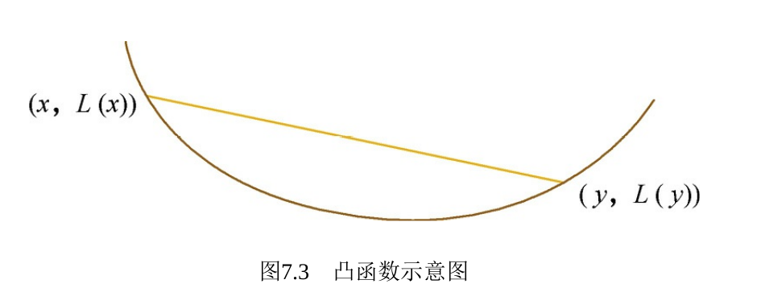

###  损失函数，激活函数和优化

#### 损失函数

##### 目标

- 用来评估模型的预测值和真实值不一样的程度，损失函数越好，模型的性能越好

##### 分类

- 经验损失函数：预测结果与真实结果的差别
- 结构损失函数：经验损失函数加上**正则项**

#### 常见损失函数

##### 0-1损失函数

- 预测值与目标值不相等时为1,否则为0
- $L(Y,f(X)) = \{1,Y \neq f(X); 0, Y = f(X)\}$

- 特点：

  - 直接定义分类错误的个数，是一个非凸的函数，不太使用

  - **感知机**使用这种损失函数，适当放宽条件可以修改为

    $$L(Y,f(X)) = \{1,|Y-f(X)| \geq T; 0, |Y-f(X)| < T\}$$

##### 绝对值损失函数

- 计算预测值与目标值的差的绝对值
- $$L(Y,f(X))=|Y-f(x)|$$

##### log对数损失函数

- $L(Y,p(Y|X)) = -log(Y|X)$
- 特点：
  - 能非常好的表征概率分布，在很多场景适用于多分类
  - 健壮性不强，相比于hinge loss对噪声非常敏感
  - **逻辑回归**的损失函数就是log对数损失函数

##### 平方损失函数

- $L(Y|f(x))=\sum_N(Y - f(x))^2$

- 特点
  - 经常应用于**回归**问题

##### 指数损失函数(exponential loss)

- $L(Y|f(X))=exp(-yf(x))$
- 特点
  - 对离群点非常敏感，经常应用在AdaBoost算法上

##### Hinge损失函数

- $L(Y,f(x)) = max(0,1-yf(x))$
- 特点
  - 如果分类正确则损失为0，分类错误则损失为$1-yf(x)$, **SVM**所使用的损失函数
  - 一般$f(x)$是预测值，在-1到1之间，y是目标值(-1,1)。其含义是$f(x)$的值是在-1和1之间就可以了，并不鼓励$|f(x)|>1$,不鼓励分类去过度自信，从而是分类器**更加关注整体的误差**
  - 健壮性相对较高，对异常点、噪声不敏感，但它没有很好的概率解释

##### 感知损失函数

- $L(Y,f(X))=max(0,-f(x))$
- 特点
  - 是Hinge损失函数的一个变种，perceptron loss只要样本的判定类别正确的话，它就满意，不管其判定边界的距离。
  - 比Hinge loss简单，但是模型泛化能力没有Hinge loss强

##### 交叉熵损失函数

- $C = \cfrac{1}{n}\sum_x[ylna +(1-y)ln(1-a)]$

- x表示样本，y表示实际的标签，a表示预测的输出，n表示样本总数量
- 特点：
  - 本质是一种**对数似然函数**，可以用于**二分类和多分类**
  - 二分类的loss函数(输入数据是softmax或者sigmoid函数的输出)
    - $loss = -\cfrac{1}{n}\sum_x[ylna +(1-y)ln(1-a)]$
  - 多分类的loss函数(输入数据是softmax或者sigmoid函数的输出)
    - $loss = -\cfrac{1}{n}\sum_iy_iln a_i$

- 使用sigmoid作为激活函数的时候，常用**交叉熵损失函数**而不用**均方误差损失函数**，因为它可以**完美解决平方损失函数权重更新过慢**的问题，均方差损失是非凸的
- 具**误差大的时候，权重更新快；误差小的时候，权重更新慢**的良好性质。

##### 1.**交叉熵函数**与**最大似然函数**的联系和区别？

区别：交叉熵函数用来描述模型预测值和真实值的差距大小，越大代表越不相近，似然函数的本质是衡量在某个参数下，整体的估计和真实情况一样的概率，越大代表越相近

联系：**交叉熵函数**可以由最大似然函数在伯努利分布的条件下推导出来，或者说**最小化交叉熵函数**的本质就是**对数似然函数的最大化**。

##### 2 如何防止过拟合

- 获取更多的数据，数据增强
- 深度学习的话，减少模型层数，神经元个数
- 正则化
- 增加噪声，在输入中加入高斯噪声与L1, L2正则化的效果类似
- Dropout

#### 激活函数

- 激活函数是为了提供网络的非线性建模能力 
- 激活函数的特点
  - 非线性： 当激活函数是线性的时候，一个两层的神经网络就可以逼近基本上所有的函数了
  - 可微性：优化方法一般基于梯度，所以要求可微
  - 单调性：激活函数是单调的，能够保证单层网络是凸函数
  - 输出值的范围： 当激活函数输出值是 有限 的时候，基于梯度的优化方法会更加稳定，因为特征的表示受有限权值的影响更显著；当激活函数的输出是 无限的时候，模型的训练会更加高效，不过在这种情况小，一般需要更小的learning rate.

##### sigmoid

$$
f(x) = \cfrac{1}{1+e^{-z}}\\
f^`(x) = f(x)(1-f(x))
$$

- 能对概率和输入的归一化
- 会出现梯度消失

##### tanh

$$
f(x)= \cfrac{1-e^{2x}}{1+e^{-2x}}\\
f^`{x} = 1 - (f(x))^2
$$

- 类似sigmoid函数，sigmoid函数输出范围是[0,1]，tanh 是[-1,1]
- 他的输出均值是0, 收敛比sigmoid快

##### relu

$$
f(x) = \begin{cases}
   0 &\text{if } x < 0 \\
   x &\text{if } x \geq 0
\end{cases}\\
f^`(x) = \begin{cases}
   0 &\text{if } x < 0 \\
   1 &\text{if } x \geq 0
\end{cases}
$$

- 计算代价小，训练速度快
- 减轻梯度消失现象
- 随着训练的推进，部分输入会落入x<0的区域，其梯度等于0，导致对应权重无法更新。这种现象被称为“神经元死亡”，改进有Leaky-ReLU

#### 凸优化问题

##### 凸函数

- 凸函数：函数$L(\cdot)$在定义域内任意亮点的x，y和任意实数 $\lambda \in[0,1]$总有：

$$
L(\lambda x + (1-\lambda) y) \leq \lambda L(x) + (1-\lambda)L(y)
$$

- 可以求解目标函数的二阶Hessian矩阵来验证凸性质，满足半正定
- 对于凸优化问题，所有的局部极小值都是全局极小值，因此一般认为这种比较容易求解
- 凸优化问题：支持向量机，线性回归
- 非凸优化问题：低秩模型，深度神经网络

##### 无约束凸优化问题的优化方法

- 直接法

  - 要求目标函数是凸函数，要有闭式解
  - 如岭回归：$L(\theta)=||X\theta -y||^2+\lambda ||\theta||^2_2$
  - 最优解可以直接给出:$\theta^*=(X^TX+\lambda I)^{-1}X^Ty$

- 迭代法：迭代地对最优解的估计

  - 假设对当前最优解的估计为$\theta_t$，求解优化问题：

  - 利用$\delta_t=argmin_{\delta}L(\theta_t+\delta)$来得到更好的估计值$\theta_{t+1}=\theta_t+\delta_t$

  - 一阶迭代法：**梯度下降法**

    - 对函数$L(\theta_t+\delta)$进行一阶泰勒展开，得到近似式

    - $L(\theta_t+\delta)\approx L(\theta_t) + \nabla L(\theta_t)^T \delta$

    - 由于该近似式只在$\delta$比较小的时候才比较准确，所以在求解中需要加上L2正则,所以

    - $$
      \delta_t=argmin_{\delta}(L(\theta_t)+\nabla L(\theta_t)^T\delta + \cfrac{1}{2\alpha}||\delta||^2_2)=-\alpha \nabla L(\theta_t)
      $$

    - 迭代公式：$\theta_{t+1}=\theta_t -\alpha \nabla L(\theta_t)$

    - 梯度就是目标函数的一阶信息

  - 二阶迭代法：牛顿法

    - 对函数$L(\theta_t+\delta)$进行二阶泰勒展开，得到近似式

    - $L(\theta_t+\delta)\approx L(\theta_t) + \nabla L(\theta_t)^T \delta +\cfrac{1}{2}\delta^T \nabla^2 L(\theta_t)\delta$

    - 其中$\nabla^2 L(\theta_t)$是函数L在$\theta_t$处的Hessian矩阵，求解近似问题

    - $$
      \delta_t=argmin_{\delta}(L(\theta_t)+\nabla L(\theta_t)^T\delta + \cfrac{1}{2}\delta^T \nabla^2 L(\theta_t)\delta)=- \nabla^2 L(\theta_t)^{-1}\nabla L(\theta_t)
      $$

    - 迭代公式：$\theta_{t+1}=\theta_t - \nabla^2 L(\theta_t)^{-1}\nabla L(\theta_t)$\

    - 二阶法收敛更快，但是矩阵求逆计算复杂度过大

#### 优化算法

##### SGD更新

- $\theta_{t+1}=\theta_t - \eta g_t$
- 负梯度为$-g_t$,$\eta$表示步幅
- 容易陷入山谷和鞍点
- 解决方案：惯性保持(momentum)和环境感知(adagrad)

##### Momentum(动量)方法

- $$
  v_t=\gamma v_{t-1}+\eta g_t \\
  \theta_{t+1}=\theta_t - v_t
  $$

- $-v_t$表示前进步伐，包括两个部分，第一个部分为带衰减的前一次步伐，第二部分表示当前估计的梯度

- 动量方法收敛更快，收敛曲线更加稳定

##### Adagrad

- 自适应学习参数更新速率

- 参数空间中，根据不同参数的一些经验性判断，自适应地确定参数的学习速率

- Adagrad采用“历史梯度平方和”来衡量不同参数的梯度的稀疏性，取值越小越稀疏

- $$
  \theta_{t+1,i}=\theta_{t,i}-\cfrac{\eta}{\sqrt{\sum_{k=0}^t} g_{k,t}^2+\epsilon} g_{t,i}
  $$

- $\theta_{t+1,i}$表示$t+1$时刻参数$\theta_{t+1}$的第i个参数，$g_{k,i}$表示k时刻的梯度向量$g_k$的第i个维度

##### Adam

- 融合了惯性保持和环境感知两个方法的优点

- Adam方法记录过往梯度与当前梯度的一阶矩，这体现了惯性保持

- 同时还记录了过往梯度和当前梯度的二阶矩，体现了环境感知

- $$
  m_t=\beta_1 m_{t-1} +(1- \beta_1) g_t\\
  v_t=\beta_2 v_{t-1} +(1- \beta_2) g_t \\
  \theta_{t+1}=\theta_t - \cfrac{\eta \cdot \hat{m_t}}{\sqrt{\hat{v_t}+\epsilon}}
  $$

- $\hat{m_t}=\cfrac{m_t}{1-\beta_1^t}$,$\hat{v_t}=\cfrac{v_t}{1-\beta_2^t}$
- 推荐参数$\alpha=0.001$、$\beta_1=0.9$、$\beta_2=0.999$ 和 $\epsilon=10E−8$

##### 如何选择优化算法

- 如果数据是稀疏的，就用自适应方法，即 Adagrad, Adadelta, RMSprop, Adam。

- RMSprop, Adadelta, Adam 在很多情况下的效果是相似的。
- Adam 就是在 RMSprop 的基础上加了 bias-correction 和 momentum。
- 随着梯度变的稀疏，Adam 比 RMSprop 效果会好。
- 整体来讲，Adam 是最好的选择。

