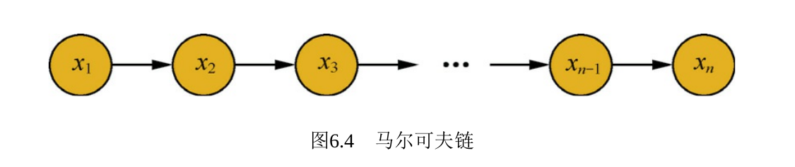
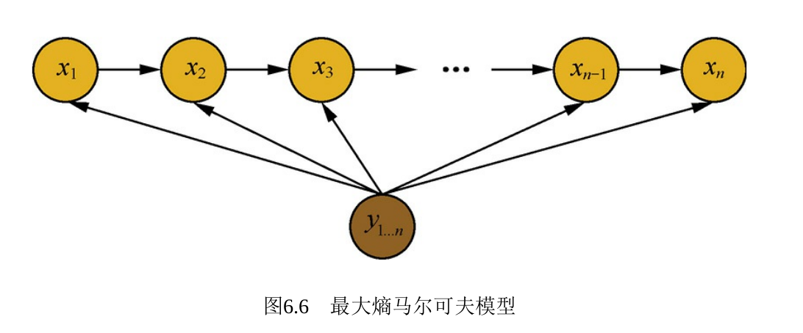
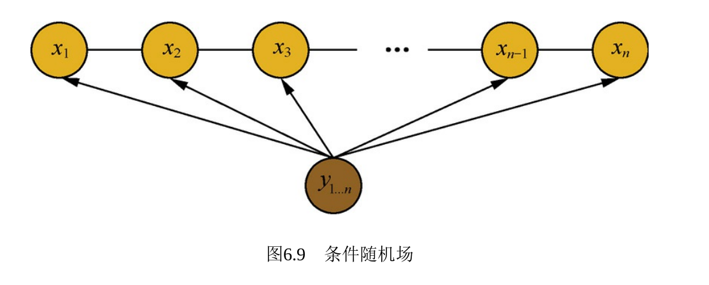

### 概率图模型

##### 贝叶斯网络和马尔科夫网络

- 贝叶斯网络是有向图，马尔科夫网络是无向图
- 贝叶斯网络的联合概率分布是通过条件概率可推导出
- 马尔科夫网络的联合概率分布
  - 定义:$P(x) = \cfrac{1}{Z} \prod_{Q \in C} \phi_Q(x_Q)$
  - C为图中最大团所构成的集合,$Z = \sum_x\prod_{Q \in C} \phi_Q(x_Q)$
  - $ \phi_Q$是团$Q$对应的势函数，非负的，并且应该在概率较大的变量上取得较大的值，例如指数函数
    - $\phi_Q(x_Q)=e^{-H_Q(x_Q)}$
    - 其中$H_Q(x_Q)=\sum_{u,v\in Q,u \neq v} \alpha_{u,v}x_ux_v+\sum_{v\in Q}\beta_vx_v$
  - 所有节点$x=\{x_1,x_2,...,x_n\}$所构成的子集，如果子集内任意两个节点都存在边，则这个子集中所有节点构成了一个团，如果这个子集中加入任意其他节点，都不能构成一个团，称这样的子集构成了一个最大团

##### 朴素贝叶斯

- 假设样本特征相互独立

$$
y=argmax_{y_i}P(y_i|x)\\
p(y_i|x) \propto p(x|y_i)p(y_i)=p(x_1|y_i)p(x_2|y_i),....p(x_n|y_i)p(y_i)
$$

##### 最大熵原理

- 熵是不确定性的度量

- 最大熵原理：

  - 在满足约束条件的模型中选择熵最大的模型，即不确定性最大的模型
    $$
    H(P)=-\sum_xP(x)logP(x)
    $$

- 生成式模型和判别式模型
- 生成式模型：对联合概率$p(x,y)$建模
  - 朴素贝叶斯，贝叶斯网络，pLSA，LDA，都是先对联合概率建模，然后根据计算边缘分布得到对变量的预测
  - 利用生成模型是根据山羊的特征首先学习出一个山羊的模型，然后根据绵羊的特征学习出一个绵羊的模型，然后从这只羊中提取特征，放到山羊模型中看概率多少，放到绵羊模型中看概率多少，哪个大就是哪个
- 判别式模型：对条件概率$p(y|x)$建模
  - 条件随机场就是对序列数据进行建模，直接对条件概率进行建模
  - 要确定一个羊是山羊还是绵羊，用判别模型的方法是从历史数据中学习到模型，然后通过提取这只羊的特征来预测出这只羊是山羊的概率，是绵羊的概率。

##### 马尔科夫模型

- 一个随机过程中，$t_n$时刻的状态$x_n$的条件分布，仅仅与前一个状态$x_{n-1}$有关，即$P(x_n|x_1,x_2,....,x_{n-1})=p(x_n|x_{n-1})$，则称其为马尔科夫过程，时间和状态都是离散的马尔科夫过程也称为马尔科夫链

  

- 隐马尔科夫模型(HMM)，是对含有未知参数(隐状态)的马尔科夫链进行建模的生成模型

  - 两个假设
    - 观测独立假设
    - 齐次马尔科夫性
  - 考虑隐状态之间的转换和隐状态到观测状态的输出概率

  

- 最大熵马尔科夫模型(MEMM)为什么会产生标注偏执问题？如何解决？

  
  - 最大熵马尔科夫模型去除了HMM模型的观测独立假设，在每个隐状态上考虑了整个观测序列

  $$
  p(x_{1...n}|y_{1...n})=\prod_{i=1}^n p(x_i|x_i,y_{1...n})\\
  p(x_i|x_{i-1},y_{1...n})=\cfrac{exp(F(x_i,x_{i-1},y_{1..n}))}{Z(x_{i-1},y_{1...n})}
  $$

  - Z为归一化因子：
    $$
    Z(x_{i-1},y_{1...n})=\sum_{x_i}exp(F(x_i,x_{i-1},y_{1...n}))
    $$

  - $F(x_i,x_{i-1},y_{1...n})$是所有特征$x_i,x_{i-1},y_{1...n}$的线性叠加

  - 最大熵马尔科夫模型会存在标注偏置问题，由于局部归一化的影响，隐状态会倾向于转移到那些后续状态可能更少的状态，以提高整体的后验概率。这就是标注偏置问题。

  - 解决方案：

    - 条件随机场

    

    
    $$
    p(x_{1...n}|y_{1...n})=\cfrac{1}{Z(y_{1...n})}\prod_{i=1}^nexp(F(x_i,x_{i-1},y_{1...n}))
    $$

    - 归一化因子在全局范围内进行归一化，枚举了整个隐状态序列$x_{1...n}$的全部可能，从而解决了局部归一化带来的标注偏置问题

##### 主题模型

###### pLSA

- 假设有K个主题，M篇文章。对语料中的任意文章d,假设有N个词，则对于每个词，我们首先选择一个主题z，然后在当前主题的基础上生成一个词w

- $$
  p(w|d)=\sum_zp(w|z,d)p(z|d)=\sum_zp(w|z)p(z|d)
  $$

- 整个文本生成概率可以用似然函数表示

- $$
  L=\prod_m^M\prod_n^Np(d_m,w_n)^{c(d_m,w_n)}
  $$

- $p(d_m,v_n)$在第m篇文章$d_m$中出现$w_n$的概率, $c(d_m,w_n)$表示第m篇文章中单词$w_n$出现的次数

- 对数似然：

- $$
  l=\sum_m^M\sum_n^Nc(d_m,w_n)log p(d_m,w_n)\\
  l=\sum_m^M\sum_n^Nc(d_m,w_n)log \sum_k^K p(d_m)p(z_k|d_m)p(w_n|z_k)
  $$

- 由于z是隐变量，所以无法直接求解，需要使用EM算法求解

###### LDA

- 以我的理解可以分为通过两个dirichlet分布和两个多项式分布来生成文章的过程

  - 第一个dirichlet分布$\alpha$取样生成文档主题分布$\theta_i$
  - 从文档主题分布$\theta_i$中生成取样文档i第j个词的主题$z_{i,j}$
  - 从第二个dirichlet分布$\beta$取样生成主题$z_{i,j}$对应的主题词分布$\phi_{z_{ij}}$
  - 从主题词分布$\phi_{z_{ij}}$采样并最终生成词语$w_{i,j}$

  - 多项式分布是二项分布在多维度的推广，二项分布的共轭分布是beta分布，dirichlet分布是beta分布在多维度的推广，dirichlet分布是多项分布的共轭先验分布-

  - LDA中概率联合分布:

    

    - 等价下式：

    

    - Gibbs采样求解,通过周围词的分布和观测的词来求出当前位置主题为k的概率

      

    -  仔细观察上述结果，可以发现，式子的右半部分便是，这个概率的值对应着的路径概率。如此，K 个topic 对应着K条路径，Gibbs Sampling 便在这K 条路径中进行采样，如下图所示

      
      
    - Gibbs采样：
    
      - 首先随机给定每个单词的主题，然后在其他变量固定的情况下，根据转移概率抽样生成每个单词的新主题
      - 对于每个单词来说，转移概率可以理解为：给定文章中的所有单词以及自身以外其他所有单词的主题，在此条件上该单词对应各个新主题的概率，经过反复迭代，可以根据收敛后的采样结果计算主题分布和词分布的期望。

#### 推荐系统的冷启动问题

- 用户冷启动(之前没有行为或者极少行为的新用户)
  - 通过用户的注册信息(年龄,性别,爱好),搜索关键词来推测用户兴趣,找到与该用户兴趣相同的用户,通过他们的历史行为来预测该新用户感兴趣的商品
  - 用户看作LDA中的一篇文档, 特征看作文档中的单词,就可以学习相应的主题分布

- 物品冷启动
  - 可以根据商品的特征推测商品对应的主题,然后根据主题向量来找到相似的商品,并将该商品推荐给喜欢这些相似商品的用户

- 系统冷启动
  - 需要先验数据,比如编辑推荐