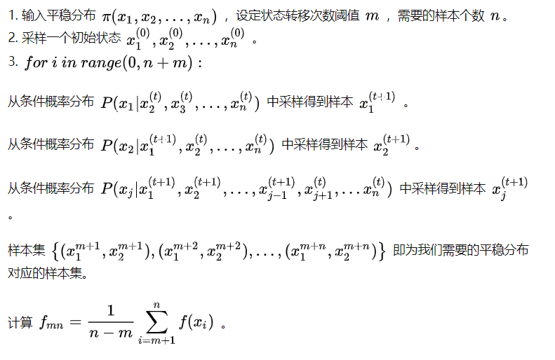

### 采样

#### 采样在机器学习中的应用

- 将复杂的分布简化为离散的样本点，用少量的样本点来近似总体分布，并刻画总体分布中的不确定性
- 可以利用重采样对样本集进行调整来更好地适应后期的模型学习
  - 利用自助法和刀切法估计统计量的偏差和方差
- 随机模拟对样本集进行复杂模型的近似求解或推理
  - 转化为某些函数在特定分布下的积分或者期望，或者求某些随机变量或参数在给定数据下的后验分布

#### 如何编程实现均匀分布随机数生成器？

- 线性同余法:$x_{t+1}=a \cdot x_t + c(mod \;\; m)$

- 利用当前随机数$x_t$进行适当变换，进而产生下一次的随机数$x_{t+1}$,初始$x_0$称为随机种子

#### 常见的采样方法

##### 逆变换法

- 如果直接从目标分布$p(x)$中不好采样x，可以构建一个变换$u=\phi(x)$,使得从变换后的分布$p(u)$采样比较容易

- 可以通过反函数$x=\phi^{-1}(u)$来间接得到x

- 在函数变换法中，如果变换关系$\phi(\cdot)$是x的累积分布函数，这就是逆变换采样。假设待采样的目标分布的概率密度函数为$p(x)$,它的累积分布函数为：

- $$
  u=\phi(x)=\int_{-\infin}^x p(t)dt
  $$

##### 拒绝-接受采样法

- 对于目标分布$p(x)$,选取一个容易采样的参考分布$q(x)$ ---(较难采样的分布一般概率密度函数复杂，如密度函数有多个变量，各变量直接互不独立，密度函数形式复杂)
  - 从参考分布$q(x)$中随机抽取一个样本$x_i$
  - 从均匀分布$U(0,1)$产生一个随机数$u_i$
  - 如果$u_i < \cfrac{p(x_i)}{M q(x_i)}$,则接受样本$x_i$,否则拒绝，重新进行步骤$(1)-(3)$，直到新产生的样本$x_i$被接受

##### 重要性采样

- 

##### 马尔科夫蒙特卡罗采样法

- 如果是高维的随机变量，拒绝采样和重要性采样经常难以找到合适的参考分布，采样效率低下(样本接受概率小，重要性权值低)

- 基本思想

  - 针对待采样的分布，构造一个马尔科夫链，使得该马尔科夫链的平稳分布就是目标分布
  - 从任何一个初始状态出发，沿着马尔科夫链进行状态转移，最终得到的状态转移序列会收敛到目标分布
  - 核心点：构造合适的马尔科夫链(**不可约**，**非周期**，**正常返** $\rightarrow$ 有唯一平稳的分布)
    - 马尔科夫链特征:

      - 不可约:每个状态都能去到
      - 非周期：返回时间公约数是1
      - 正常返：离开此状态有限步会返回
      - 零常返: 离开此状态能返回，但需要无穷多步
      - 非常返：离开此状态有限步不一定能回来
      - 遍历定理: **不可约**，**非周期**，**正常返** $\rightarrow$ 有唯一平稳的分布

- Metropolis-Hastings 采样法

  - 输入我们任意选定的马尔科夫链状态转移矩阵 ![[公式]](https://www.zhihu.com/equation?tex=Q) ，平稳分布 ![[公式]](https://www.zhihu.com/equation?tex=%CF%80) ，设定状态转移次数阈值 ![[公式]](https://www.zhihu.com/equation?tex=m) ，需要的样本个数 ![[公式]](https://www.zhihu.com/equation?tex=n)。
    - 采样一个初始状态 ![[公式]](https://www.zhihu.com/equation?tex=x_0) 。
    - ![[公式]](https://www.zhihu.com/equation?tex=for%5C+i%5C+in%5C+range%280%2C+n%2Bm%29%3A)
    - 从马尔科夫链 ![[公式]](https://www.zhihu.com/equation?tex=Q) 中游走一次采样一个样本 ![[公式]](https://www.zhihu.com/equation?tex=x_%2A) 。
    - 产生一个 ![[公式]](https://www.zhihu.com/equation?tex=%5B0%2C1%5D) (均匀分布)之间的随机数 ![[公式]](https://www.zhihu.com/equation?tex=u) 。
    - 如果 ![[公式]](https://www.zhihu.com/equation?tex=u%3C%5Calpha_%7Bx_%2A%2Cx_i%7D%3Dmin%5Cleft%5C%7B+%5Cfrac%7B%CF%80_%7Bx_%7B%2A%7D%7DQ_%7Bx_i%2Cx_%2A%7D%7D%7B%CF%80_%7Bx_%7Bi%7D%7DQ_%7Bx_%2A%2Cx_i%7D%7D%2C1+%5Cright%5C%7D) (从状态 ![[公式]](https://www.zhihu.com/equation?tex=x_i) 到状态 ![[公式]](https://www.zhihu.com/equation?tex=x_%2A) )，则接收转移 ![[公式]](https://www.zhihu.com/equation?tex=x_i%5Crightarrow+x_%2A%2Cx_%7Bi%2B1%7D%3Dx_%2A) 。
    - 否则不接受转移，即 ![[公式]](https://www.zhihu.com/equation?tex=x_%7Bi%2B1%7D%3Dx_i)。

  - 样本集 ![[公式]](https://www.zhihu.com/equation?tex=%28x_%7Bm%7D%2C...%2Cx_%7Bn%2Bm-1%7D%29) 即为我们需要的平稳分布对应的样本集。

  - 计算 ![[公式]](https://www.zhihu.com/equation?tex=f_%7Bmn%7D%3D%5Cfrac%7B1%7D%7Bn-m%7D%5Csum_%7Bi%3Dm%2B1%7D%5E%7Bn%7D%7Bf%28x_i%29%7D) 。

  - 很多时候，我们选择的马尔科夫链状态转移矩阵如果是对称的，即满足 ![[公式]](https://www.zhihu.com/equation?tex=Q_%7Bi%2Cj%7D%3DQ_%7Bj%2Ci%7D) ，这时我们的接受率可以进一步简化为：

  ![[公式]](https://www.zhihu.com/equation?tex=%5Calpha_%7Bj%2Ci%7D%3Dmin%5Cleft%5C%7B+%5Cfrac%7B%CF%80_j%7D%7B%CF%80_i%7D%2C1+%5Cright%5C%7D)

- 吉比斯采样

  - 吉比斯采样的目标是从一个已知的目标分布$p(x)$进行采样，并估计某个函数的期望值。$p(x)$是一个多维的随机分布，$p(x)$的联合分布复杂，难以采样，但是能够很容易采样条件概率分布

  

- MCMC采样每一步都会产生一个样本，有可能这个样本与之前的样本一样

- MCMC采样的样本序列相邻的样本不是独立的，因为后一个样本是有前一个样本根据特定的转移概率得到的