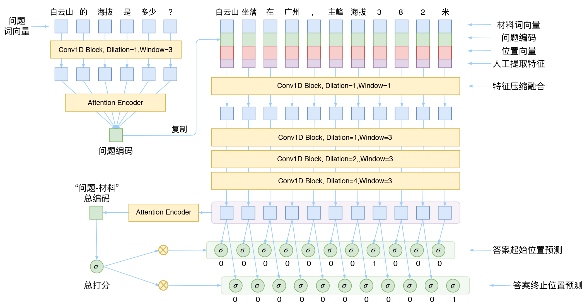
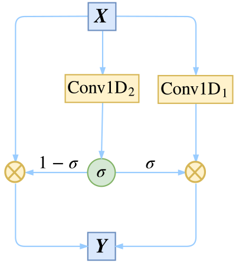
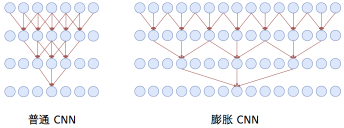

## DGCNN(Dilate Gated Convolutional Neural Network)

- 膨胀门卷积神经网络
  - 基于膨胀卷积和门卷积的CNN神经网络
- 

#### 门机制

- 参照论文[Convolutional Sequence to Sequence Learning](https://arxiv.org/abs/1705.03122)

- 对于一个向量序列$\boldsymbol{X}=[\boldsymbol{x}_1,\boldsymbol{x}_2,\dots,\boldsymbol{x}_n]$,可以给普通的一维卷积加一个门控机制

- $$
  \boldsymbol{Y}=\text{Conv1D}_1(\boldsymbol{X}) \otimes \sigma\Big(\text{Conv1D}_2(\boldsymbol{X})\Big)
  $$

- 两个Conv1D形式一样（比如卷积核数、窗口大小都一样），但权值是不共享的，也就是说参数翻倍了，其中一个用sigmoid函数激活，另外一个不加激活函数，然后将它们逐位相乘

- 直觉来看就是对Conv1D的每个输出加了一个"阀门"来控制流量，这就是GCNN的结构了

- 用GCNN的一个好处是梯度消失的风险更低，因为有一个卷积是不加任意激活函数的，没加激活函数的这部分卷积不容易梯度消失。如果输入和输出的维度大小一致，那么我们就把输入也加到里边，即使用残差结构
- 

$$
\ell(x, y) = L = \{l_1,\dots,l_N\}^\top, \quad
        l_n = - w_n \left[ y_n \cdot \log x_n + (1 - y_n) \cdot \log (1 - x_n) \right]\\
             \ell(x, y) = \begin{cases}
            \operatorname{mean}(L), & \text{if reduction} = \text{`mean';}\\
            \operatorname{sum}(L),  & \text{if reduction} = \text{`sum'.}
        \end{cases}
$$

#### **膨胀卷积**

- 

- 膨胀卷积跳过与中心直接相邻的输入，直接捕捉中心和次相邻的输入（膨胀率为2）