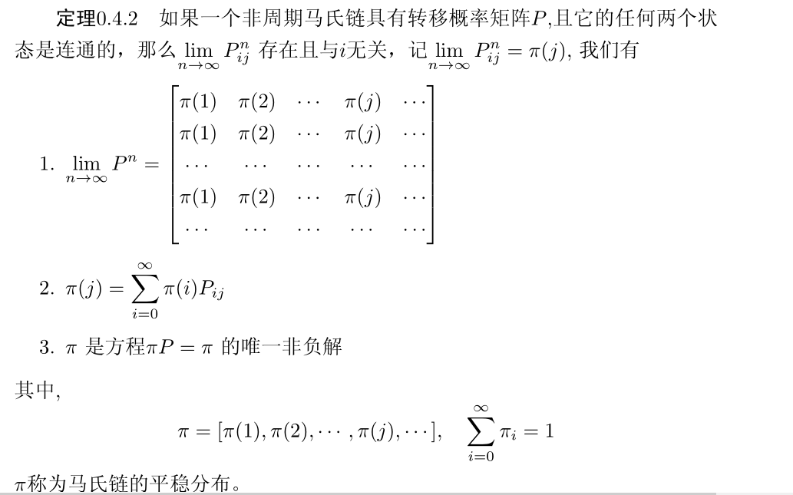
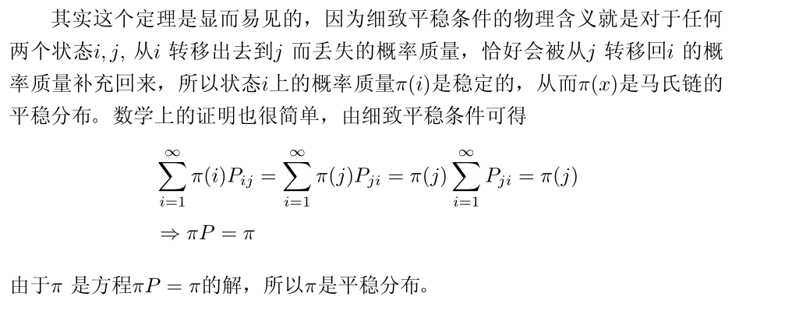
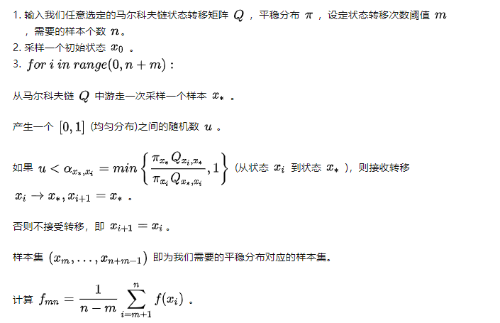
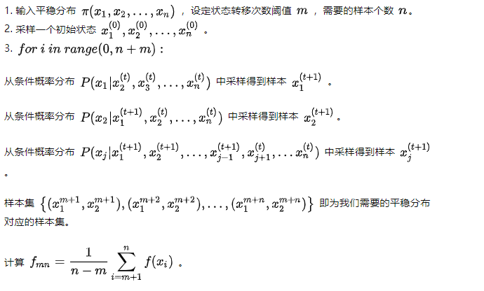

## Markov Chain & Monte Carlo

#### 背景

- 推断：存在一些数据X和隐变量Z，给定一个先验$p(X|Z)$,来得到一个后验$p(Z|X)$,因为直接计算很困难，所以需要使用推断的方法
  - 精确推断
  - 近似推断：确定性：VI| 随机性：MCMC
  
  #### Monte Carlo Method：基于采样的随机近似方法
  
  - 如果需要求一个后验$p(Z|X)$,可以转变为求期望问题,$E_{Z|X}[f(z)]=\int_Z f(Z) dZ$
  - 假设能够采样到N个$Z_i ~ p(Z|X)$,那么$E_{Z|X}[f(z)]=\cfrac{1}{N}f(z_i)$​
  
- 采样方法
  - 抽象定义：通过概率模型的随机抽样来进行近似数值计算的方法,比如估计$\pi$
  - 简单理解：目标是求解某个**参量**，直接求解出现困难，将其构建为一个合适的概率模型，对这个模型进行大量的采样和统计实验，使它的某些**统计参量**正好待求问题的解，只需要把这个参量的值统计出来，那么问题的解就是估计的值。
  - 基于概率分布采样
    - 已知一个PDF(概率密度函数)的CDF(累积密度函数)，可以使用均分分布得到的随机点${x_1,x_2...,x_n}$，然后带入CDF求反函数
      - 设若$F_x(X)$是概率分布X的累积分布函数，并存在反函数$F_{x}^{-1}(X)$。若*a*是[0,1)区间上均匀分布的随机变量，则$F_{x}^{-1}(a)$​服从X分布。
      - 有很多概率分布无CDF，所以该方法在很多场景不work
  - 拒绝-接受采样
  - 
    - 这种方法适用于$p(x)$极度复杂不规则的情况
    - 利用$q(x)$​进行采样，然后设置一定概率$\alpha=\cfrac{p(x_i)}{cq(x_i)}$来接受和保留它
    - 步骤
      - 采样一个$x_i \sim q(x)$​​，从0-1均匀分布采样一个u
      - 如果$u \ne \alpha$ ,接受$x_i$
      - 否则丢弃它
    - 条件
      - $q(x)$​是一个已知的分布，$cq(x)$越接近$p(x)$效率越高
      - $\forall x cq(x) \ge p(x)$

- 重要性采样

  - 不是直接对概率分布采样，是对其期望进行采样

  - $$
    E_{Z|X}[f(z)]= \int p(z)f(z) dz = \int \cfrac{p(z)}{q(z)}q(z)f(z)dz \approx \cfrac{1}{N} \sum_{i=1}^Nf(z_i) \cfrac{p(z_i)}{q(z_i)}
    $$

  - 重要性体现在$\cfrac{p(z_i)}{q(z_i)}$
  - 该方法也严重依赖$q(z)$的选取

#### Markov Chair

- 时间和状态都是离散的随机过程，状态转移矩阵：$p_{ij}=p(X_{t+1}=j|X_t=i)$
- $p(X_{t+1}=x|x_1,x_2,..x_t)=p(X_{t+1}=x|x_t)$

- 平稳分布：有下定理成立，这个序列就叫马尔可夫链 $\{X_{t+1}\}$ 的平稳分布，平稳分布就是表示在某一个时刻后，分布不再改变。
- 

- Detail balance:细致平稳条件
  - $\Pi(x)p(x \rightarrow x^{*})=\Pi({x^*})p(x^*\rightarrow x)$
  - 

#### Metropolis-Hastings采样算法

**算法流程**

#### Gibbs 采样

- 擅长解决多维问题

#### MCMC回顾

- 采样的动机
  - 采样本身就是一种机器学习任务，例如从某个分布中采样数据
  - 求和和求积分

- 什么才叫好样本
  - 样本趋向于高概率区域
  - 样本之间相互独立
- 采样的困难
  - partition function 不可求
  - 高维
- MCMC的问题
  - 理论上只保证收敛性，不能确定何时收敛
  - mix time过长(p(x)太复杂，高维且相关联)
  - 样本之间有相关性
