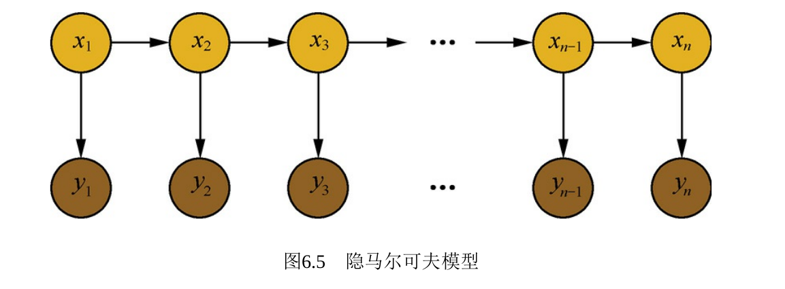

## HMM

### HMM背景

#### HMM 隐马尔可夫模型

- 定义
  - $\lambda = (\pi,A,B)$
  - $\pi$:初始概率分布
  - A:状态转移矩阵
  - B:发射矩阵
  -  观测变量: o1,o2,...,$o_t$​,... $\rightarrow$​ V={$v_1,v_2,...v_n$​​}
  -  状态变量: i1,i2,...,$i_t$​,... $\rightarrow$​ Q={$q_1,q_2,...q_m$​​​}
  - $A=[a_{ij}],a_{ij}=p(i_{t+1}=q_j|i_t=q_i)$
  - $B=[b_j(k)],b_j(k)=p(O_t=q_k|i_t=q_j)$​​

- 两个假设
  - 观测独立性 $p(i_{t+1}|i_{1},...,i_{t},o_1,...,o_t)=p(i_{t+1}|i_t)$
  - 齐次马尔可夫性$p(o_{t}|i_{1},...,i_{t},o_1,...,o_t)=p(o_{t}|i_t)$

- 三个问题
  - Evaluation：给定$\lambda$,求解$P(O|\lambda)$,前向后向算法
  - Learning：$\lambda$如何求解，EM
  - Decoding: $argmax\;p(I|O)$​
    - 预测:$p(i_{t+1}|o1,o2,...o_t)$
    - 滤波:$p(i_{t}|o1,o2,...o_t)$

### Evaluation问题

#### 前向算法

**求解Evaluation问题：给定$\lambda$,求解$P(O|\lambda)$**

- $p(O|\lambda)=\sum_Ip(I,O|\lambda) = \sum_Ip(O|I,\lambda)P(I|\lambda)$​
- $p(I|\lambda)=p(i_1,i_2,...,i_T|\lambda)=p(i_T|i_1,i_2,...,i_{T-1},\lambda)p(i_1,i_2,...,i_{T-1},\lambda)=\pi(a_{i_1}) \prod_{t=2}^Ta_{i_{t-1}}a_{i_t}$​
- $p(O|I,\lambda)=\prod_{t=1}^Tb_{i_t}(O_t)$
- $p(O|\lambda)=\sum_I\pi(a_{i_1}) \prod_{t=2}^Ta_{i_{t-1}}a_{i_t}\prod_{t=1}^Tb_{i_t}(O_t)$​
- 令$\alpha_t(i)=P(o_1,o_2,...,i_t=q_i|\lambda)$
  - $\alpha_T(i)=P(O,i_t=q_i|\lambda)$
  - $P(O|\lambda)=\sum_{i=1}^Np(O,i_t=q_i|\lambda)=\sum_{i=1}^N \alpha_T(i)$​
- $O(T*N^2)$
  
- 推导$\alpha_{t+1}(j)$到$\alpha_{t}(i)$
  $$
  \begin{align}
  \alpha_{t+1}(j)
  &= p(o_1,o_2,..,o_{t+1},i_{t+1}=q_j|\lambda)\\
  &= \sum_{i=1}^N p(o_1,o_2,..,o_{t+1},i_{t+1}=q_j,i_{t}=q_i|\lambda)\\
  &= \sum_{i=1}^N p(o_{t+1}|o_1,o_2,..,o_{t},i_{t+1}=q_j,i_{t}=q_i|\lambda)p(o_1,...,o_t,i_t=q_i,i_{t+1}=q_j|\lambda)\\
  &= \sum_{i=1}^N p(o_{t+1}|i_{t+1}=q_j)p(i_{t+1}=q_j|o_1,o_2,..,o_{t},i_{t}=q_j,i_{t}=q_i|\lambda)p(o_1,...o_t，i_t=q_i|\lambda)\\
  &=\sum_{i=1}^Np(o_{t+1}|i_{t+1})p(i_{t+1}=q_j|i_t=q_i,\lambda)\alpha_t(i)
  \end{align}
  $$
  

#### 后向算法

- 引入$\beta_t(i)=P(o_{t+1},...,o_{T}|i_t=q_i,\lambda)$​

  - $\beta_1(i)=P(o_{2},...,o_{T}|i_t=q_i,\lambda)$

  - $P(O|\lambda)$与$\beta_t(i)$​的关系

  - $$
    \begin{align}
    P(O|\lambda)
    &= P(o_1,..,o_T|\lambda)\\
    &= \sum_{i=1}^N p(o_1,...,o_T,i_t=q_i)\\
    &= \sum_{i=1}^N p(o_1,...,o_T|i_t=q_i)p(i_t=q_i)\\
    &= \sum_{i=1}^N p(o_1|o_2...,o_T|i_t=q_i)p(o_2,...,o_T|i_t=q_i)p(i_t=q_i)\\
    &= \sum_{i=1}^N p(o_1|i_1=q_i) \beta_1(i) p(i_t=q_i)\\
    &= b_i(o_1) \beta_1(i) p(i_t=q_i)
    \end{align}
    $$

  - $\beta_{t}(i)$​的递推式

  - $$
    \begin{align}
    \beta_t(i)
    &=P(o_{t+1},...,o_{T}|i_t=q_i)\\
    &= \sum_{j=1}^N P(o_{t+1},...,o_{T},i_{t+1}=q_j|i_t=q_i)\\
    &= \sum_{j=1}^N P(o_{t+1},...,o_{T},i_{t+1}=q_j|i_{t+1} =q_j,i_t=q_i)P(i_{t+1}=q_j|i_{t}=q_i) \\
    &= \sum_{j=1}^N P(o_{t+1},...,o_{T}|i_{t+1}=q_j)a_{ij}\\
    &= \sum_{j=1}^N P(o_{t+1}|o_{t+2},...o_T,i_{t+1}=q_j)P(o_{t+2},...,o_{T}|i_{t+1}=q_j)a_{ij}\\
    &=\sum_{j=1}^N b_j(o_{t+1}) \beta_{t+1}(j)a_{ij} 
    \end{align}
    $$

    

#### 结论 

1. $p(O|\lambda)=\sum_Ip(O,I|\lambda)=\sum_I pi_{i1} \prod_{i=2}^T a_{t-1,t}\prod b_{i_t}(O_t)$
2. $\alpha_t(i)=\sum_{i=1}^Np(o_{t+1}|i_{t+1})p(i_{t+1}=q_j|i_t=q_i,\lambda)\alpha_t(i)$
3. $\beta_t(i)=\sum_{j=1}^N b_j(o_{t+1}) \beta_{t+1}(j)a_{ij} $
4. $\alpha_T(i)=P(O,i_t=q_i|\lambda)$
5. $P(O|\lambda)=\sum_{i=1}^Np(O,i_t=q_i|\lambda)=\sum_{i=1}^N \alpha_T(i)$
6. $\beta_1(i)=P(o_{2},...,o_{T}|i_t=q_i,\lambda)$
7. $P(O|\lambda)= b_i(o_1) \beta_1(i) p(i_t=q_i)$

### Learning问题

#### EM算法-Baum Welch

- $\theta^{t+1} = argmax_{\theta} \int_Z P(X,Z|\theta) P (Z|X,\theta^{t})dZ$

- X:观测数据，对应HMM中的O；Z:隐变量，对应HMM中的I；$\theta$: 参数,对应$\lambda$

- $\lambda^{t+1}=argmax_{\lambda} \sum_I P(O,I|\lambda)P(I|O,\lambda^{t})$
  - 又因为$P(I|O,\lambda^t) = \cfrac{P(I,O|\lambda^t)}{P(O,\lambda^t)}$,且分母又是一个与$\lambda$无关的项，所以原式可以修改为
  - $\lambda^{t+1}=argmax_{\lambda} \sum_I P(O,I|\lambda)P(I,O|\lambda^{t})$

- 待求解问题$\lambda^t=(\pi^t,A^t,B^t)$

- 令$Q(\lambda,\lambda^t)= \sum_I P(O,I|\lambda)P(I|O,\lambda^{t})$ 根据learning中的结论1，并进行log变换

- 推理得到：$Q(\lambda,\lambda^t)= \sum_I [(log \pi_{i1}+\sum_{t=2}^T log a_{i_{t-1,i_t}} + \sum_{t=1}^T log b_{i_t}(O_t))P(O,I|\lambda^t)]$

- 求解$\pi$, 只考虑和$\pi$有关的项

- $\pi^{t+1}=argmax_{\pi} \sum_I[log \pi_{i1} P(O,I|\lambda^t)] = argmax_{\pi} \sum_{i_1} ...\sum_{i_t} [log \pi_{i_1} p(O,i_1,...i_T|\lambda^{t})]$

- 求和就是积分，可以看出$i_2,..i_T$会被积分积掉 

- 最终$\pi^{t+1}=argmax_{\pi} \sum_i^N [log \pi_i P(O,i_1=q_i|\lambda^t)]$,同时存在约束$\sum_i^N \pi_i=1$

- 使用拉格朗日乘子法求解：

-  
  $$
  \mathcal{L}(\pi,\eta) = \sum_i^N [log \pi_i P(O,i_1=q_i|\lambda^t)] + \eta(\sum_i^N \pi_i-1)
  $$

- 求导：$\cfrac{\part \mathcal(L)}{\part \pi_i}=\cfrac{1}{\pi_i} P(O,i_1=q_i|\lambda^t) + \eta = 0$,即$P(O,i_1=q_i|\lambda^t) + \pi_i\eta = 0$

- 可推导$\sum_{i=1}^N[P(O,i_1=q_i|\lambda^t) + \pi_i\eta] = 0$,即$P(O|\lambda^t) + \eta = 0$,推导得出$\eta = -P(O|\lambda^t)$

- 最终可得$\pi_i^{t+1}=\cfrac{P(O,i_1=q_i|\lambda^t)}{P(O|\lambda^t)}$

- 该算法称为：**Baum Welch**

### Decoding 问题

$\hat{I}=argmax_IP(I|O,\lambda)$

#### Viterbi算法

- 动态规划思想，每步都取转移概率最大的那步骤

- $\sigma_t(i) = max_{i_!,i_2,...,i_{t-1}}P(O_1,...,O_t,i_1,...i_{t-1},i_t=q_i)$,表示概率
- $\sigma_{t+1}(j) = max_{i_1,i_2,...,i_{t}}P(O_1,...,O_t,O_{t+1},i_1,...i_{t},i_{t+1}=q_j)=max_{1\le i \le N} \sigma_t(i)a_{ij}b_j(O_{t+1})$

- $\phi_{t+1}(j) = argmax_{1\le i \le N} \sigma_t(i)a_{ij}$

### HMM总结

- 在推理框架下，state space Model的几类问题
  - decoding: $P(z_1,z_2,,z_t|x_1,x_2,..x_t)$
  - prod of evidence: $P(X|\theta)=P(x_1,x_2,...x_T|\theta)$
  - filtering: $P(Z_t|x_1,x_2,..,x_t)$ $\rightarrow$ online
  - smothing: $P(Z_t|x_1,x_2,..,x_T)$ $\rightarrow$ 离线复盘
  - prediction: $P(Z_{t+1},Z_{t+2}|x_1,x_2,...x_t)$或者$P(x_{t+1},x_{t+2}|x_1,x_2,...x_t)$