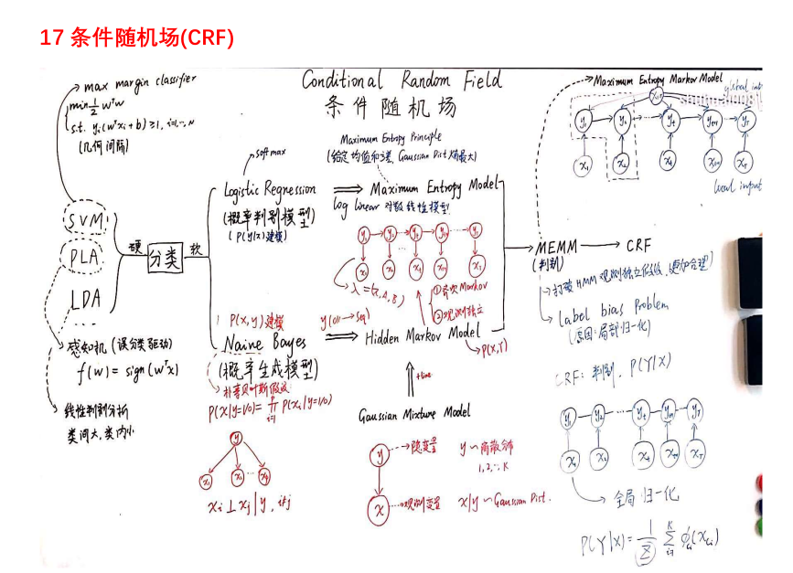
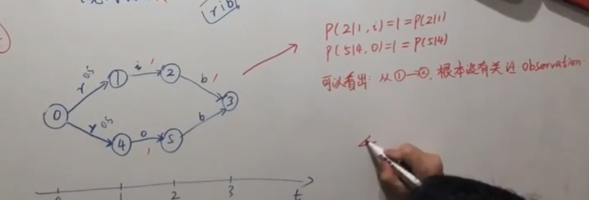

[TOC]

## 条件随机场

##### 分类问题可以根据是否是概率模型分类为硬分类和软分类

- 硬分类

  - SVM：基于几何间隔
  - PLA：基于误差进行分类
  - LDA(线性判别分析)：类间大，类内小

- 软分类

  - 概率判别模型：对$P(Y|X)$建模，{例如对羊进行分类，根据给定羊的特征来分类是山羊还是绵羊}

    - Logistic回归：与条件随机场相关的判别模型,是最大熵模型的一个特例
    - 最大熵模型：Logistic 回归模型的损失函数为**交叉熵**，这类模型也叫对数线性模型
    - 最大熵思想: 给定均值和方差, Gaussian Dist 熵最大

  - 概率生成模型：对$P(X,Y)$建模，{在样本数据中学习出山羊和绵羊的分布，然后将给定羊的特征输入不同的分布，得出的概率大小确定羊的类别}  

    - 朴素贝叶斯：与条件随机场相关的生成模型，**假设过于强，认为关于y的所有$x_i$都是独立的**

    - 隐马尔科夫模型：同样存在连个重要的假设

      - 齐次马尔科夫假设：**假设**隐藏的**马尔科夫**链在任意时刻t的状态只依赖于其前一时刻的状态，与其他时刻的状态及观测无关，也与时刻t无关
      - 观测独立假设：即**假设**任意时刻的观测只依赖于该时刻的**马尔科夫**链的状态，与其他观测即状态无关。

      - 从贝叶斯模型到隐马尔科夫模型是将y(1/0) 转移到 序列上
      - 从高斯模型到隐马尔科夫模型是在高斯模型上加上时序

      

##### MEMM(最大熵马尔科夫模型)：

- 观测变量变成了输入的马尔科夫模型
- 可以将模型的输入视为两个部分，一个是全局影响，一个是局部影响，这样就**破坏了观测独立性**（更加合理）

- 带来了标注偏差问题 label bias problem
  - 原因：局部归一化 ，CRF的提出就是为了解决标注偏差问题；隐状态会倾向于转移到那些后续状态可能更少的状态上
  - CRF对MEMM的变化，将有向图转变为无向图，无向图天然具有**全局归一化**性质, 解决了序列标注问题
  - 

##### HMM vs MEMM

-  HMM的模型
   - 定义:$\lambda = (\pi,A,B)$, $\pi$ 表示概率分布，A表示转移矩阵，B表示发散矩阵
   - 齐次一阶马尔科夫性：为了简便运算（一阶：给定$y_2$,$y_3$与$y_1$是无关的）$P(y_i|y_1,y_2,...y_{i-1},x_1,x_2,...x_{t-1})=P(y_i|y_{i-1})$
   - 观测独立假设: $P(x_t|x_{1:t},y_{1:t})=P(x_t|y_t)$
   - 建模对象:$P(X,Y|\lambda)$

- MEMM模型
  - 打破了观测独立假设: (虚线框里),在给定$y_t$的情况下,$x_t$和$y_{t-1}$不独立 
  - 建模对象:$P(Y|X,\lambda)=\sum_{t=1}^TP(y_t|y_{t-1},x_{1:T},\lambda)$
  - 优点
    - 判别式模型
    - 打破观测独立假设性(改变发射方向)
  - 缺点
    - Label Bias Problem $\rightarrow$ 归一化
    - 
    - 可以看出从状态1转移到状态2 ,观测变量对这一转移没有产生影响,导致训练的模型出现较大偏差,
    - 条件概率分布的熵越低,它就会越少考虑observation

#### MEMM vs CRF

- CRF 打破了马尔科夫性, 从有向到无向图, 克服了 label bias 问题

#### CRF的概率密度参数形式

- 判别式模型, 仍然是对条件概率建模$P(Y|X)$
- 无向图模型$\rightarrow$​随机场
- 之所以可以从全局图推导到只跟$y_i,y_{i-1}$有关，是因为最大团的性质 
- CRF的PDF,这里非常难懂，这里利用了马尔可夫网络的性质
  - $P(Y|X)=\cfrac{1}{Z}exp \sum_{t=1}^T[\sum_{k=1}^K \lambda_k f_k(y_{t-1},y_t,X_{1:T}) + \sum_{l=1}^L n_lg_l(y_t,X_{1:T})]$​​
  - 前半部分类似转移函数，后半部分类似指示函数

#### CRF要解决的问题

- Learning: parameter estimation 
  - $\hat{\theta}=argmax \prod_{i=1}^N P(y^i|x^i)$
- Inference:
  - marginal prob: $P(y_t|x)$
  - condtional prob: 生成模型
  - MAP Inference: decoding
    - $\hat{y}=argmax_{y=y_1y_2,...y_T}P(y|x)$

