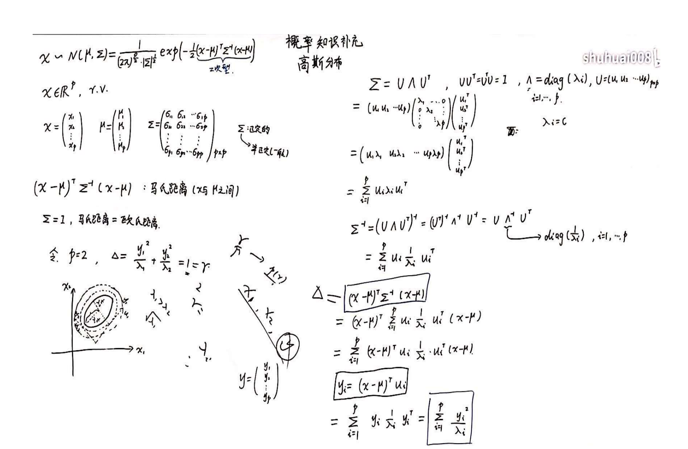
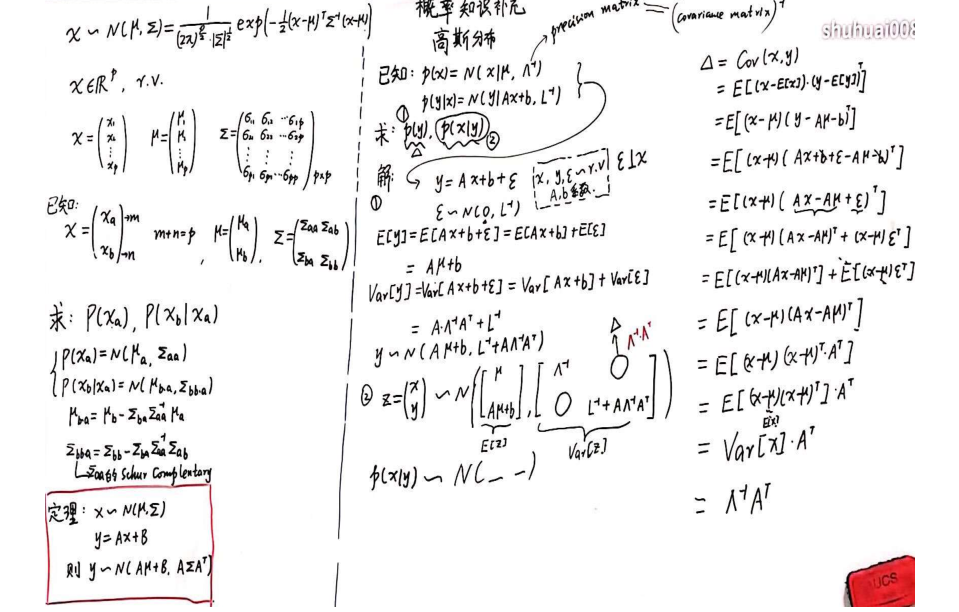

### 高斯分布

****

#### 高斯分布基本介绍

- Data:$X=\{x_1,x_2,...,x_n\}^T \in \R^{N \times p}$

- $x_i \in \R^p$, $x_i \underrightarrow{iid} \;N(\mu,\Sigma)$

-  以一维x为例的PDF
  $$
  p(X)=\cfrac{1}{\sqrt{2\pi}\sigma}exp(-\cfrac{(x-\mu)^2}{2\sigma^2})
  $$
  
- 拓展到多维：
  $$
  p(X)=\cfrac{1}{(2\pi)^{p/2} |\Sigma|^{1/2}}exp(-\cfrac{1}{2}(x-\mu) \Sigma^{-1}(x-\mu))
  $$

- 

- $$
  logp(x|\theta)=log \prod^N_{i=1}(x_i|\theta)=\sum^N_{i=1}log p(x_i|\theta)\\
  =\sum^N_{i=1}log \cfrac{1}{\sqrt{2\pi}\sigma} exp(-\cfrac{(x_i-\mu)^2}{2\sigma^2})\\
  =\sum^N_{i=1}[log\cfrac{1}{\sqrt{2\pi}}+ log \cfrac{1}{\sigma}-\cfrac{x_i-\mu}{2\sigma^2}]\\
  $$

- 从高斯分布，极大似然估计推导到最小二乘法

- 目标函数$y=ax+b$，拟合的函数为$Y=ax+b+\epsilon$，其中$\epsilon \backsim N(0,\sigma^2)$

- $$
  L(y|x,a,b)= \prod^N_{i=1} \cfrac{1}{\sqrt{2\pi}\sigma} exp(-\cfrac{(y_i-ax_i-b)^2}{2\sigma^2})\\
  log L(y|x,a,b)= \sum^N_{i=1}[log\cfrac{1}{\sqrt{2\pi}}+ log \cfrac{1}{\sigma}-\cfrac{y_i-ax_i-b}{2\sigma^2}]
  $$

- 

- $$
  argmax_{a,b}L = argmin_{a,b} \sum^N_{=1}(y_i-ax_i-b)^2
  $$

- 无偏估计：$\mu_{MLE}=\cfrac{1}{N} \sum^N_{i=1}x_i$

- 有偏估计: $\sigma_{MLE}=\cfrac{1}{N}\sum^N_{i=1}(x_i-\mu)^2=\cfrac{N-1}{N}\hat{\sigma}$,使用极大似然估计很可能低估高斯分布的方差
- 无偏估计：$\hat{\sigma}=\cfrac{1}{N-1}\sum^N_{i=1}(x_i-\mu)^2$

- 无偏估计是期望等于原表示

#### 从概率密度函数角度考察

- $(x-\mu)^T\sum^{-1}(x-\mu)$:可以认为是一个x和$\mu$马氏距离,$\sum$表示协方差矩阵
- 正交矩阵是单位向量组成的矩阵
- 

- 高斯分布的密度函数p(x)可以认为是不同r的椭圆面积的大小

#### 局限性

- 参数量太大，主要是方差$\Sigma$矩阵:$\cfrac{p(p+1)}{2}$
  - 解决方案：使用对角矩阵近似方差矩阵
- 高斯分布本身不足以表达数据的分布
  - 高斯混合模型

#### 高斯分布的边缘概率和条件概率

- 已知 $X = \begin{pmatrix} X_a  \\ X_b \end{pmatrix}$,$X_a$为m维，$X_b$为n维，$m+n=p$,$\mu = \begin{pmatrix} \mu_a  \\ \mu_b \end{pmatrix}$,$\Sigma = \begin{pmatrix} \Sigma_{aa} & \Sigma_{ab} \\ \Sigma_{ba} & \Sigma_{bb} \end{pmatrix}$

- 求$p(X_a),p(X_b|X_a)$
  - PRML对于这个问题采用配方法求解

  - 定理：

    - 已知 $X \sim N(\mu,\Sigma)$,$y = AX + B$,可得 $y \sim N(A\mu+B,A\Sigma A^T)$

  - 求$p(X_a)$

    - $X = (I_m,)_n)\begin{pmatrix} X_a  \\ X_b \end{pmatrix}$

    - $E[X_a] = (I_m,O_n)\begin{pmatrix} \mu_a  \\ \mu_b \end{pmatrix}=\mu_a$
    - $Var[X_a]= (I_m,0_n)\begin{pmatrix} \Sigma_{aa} & \Sigma_{ab} \\ \Sigma_{ba} & \Sigma_{bb} \end{pmatrix}\begin{pmatrix} I_m  \\ 0_n \end{pmatrix}=(\Sigma_{aa},\Sigma_{ab})\begin{pmatrix} I_m  \\ 0_n \end{pmatrix}=\Sigma_{aa}$
    - $X_a \sim N(\mu_a,\Sigma_{aa})$

  - $p(X_b|X_a)$

    - $\mu_{b.a}=\mu_b-\Sigma_{ba}\Sigma_{aa}^{-1}\mu_a$
    - $\Sigma_{bb.a}=\Sigma_{bb}-\Sigma_{ba}\Sigma_{aa}^{-1}\Sigma_{ab}$,Schur Complentary
    - $X_b|X_a \sim N(\mu_ba+\Sigma_{ba}\Sigma_{aa}^{-1}X_a,\Sigma_{bb.a})$

- 线性高斯模型问题

  - 已知$p(x)=N(x|\mu,\Lambda^{-1})$
  - $p(y|x)=N(y|Ax+b,L^{-1})$
  - 求$p(y)$,$p(x|y)$
  - $p(y)$
    - $y = Ax+b+\epsilon$,$\epsilon \sim N(0,L^{-1})$
    - $E[y]=E[Ax+b]+E[\epsilon]=A\mu+b$
    - $var[y] = var[Ax+b]+var[\epsilon]=L^{-1}+A\Lambda^{-1}A^{T}$
    - $y\sim N(A\mu+b,L^{-1}+A\Lambda^{-1}A^{T})$
  - $p(x|y)$

  