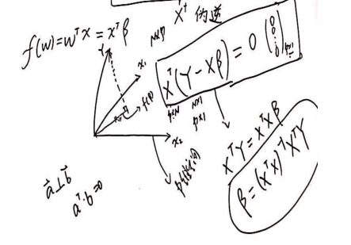

### 线性回归

#### 线性回归

- 问题
  - $X=(x_1,x_2,x_3,...x_N)^T$
  - $x_i \in R^{p}$
  - $Y=(y_1,y_2,y_3,..,y_N)$
  - 求解 $f(w)=w^Tx$

- 最小二乘估计

  - 前提假设X是列满秩的

  $$
  L(w)=\sum_{i=1}^{N}||w^Tx_i-y_i||^2\\
  =\sum_{i=1}^{N}(w^Tx_i-y_i)^2\\
  =(w^Tx_1-y_1,w^Tx_2-y_2,...,w^Tx_N-y_N)\begin{pmatrix} w^Tx_1-y_1  \\w^Tx_2-y_2\\... \\w^Tx_N-y_N \end{pmatrix}\\
  $$

  

  - 又$(w^Tx_1-y_1,w^Tx_2-y_2,...,w^Tx_N-y_N)= w^T(x_1,x_2,...,x_N)-(y_1,y_2,...y_N)
    = w^TX^T-Y^T$
  - 故

  $$
  L(w)=(w^TX-Y^T)(Xw-Y)=w^TX^TXw-w^TX^TY-Y^TXw+Y^TY=w^TX^TXw-2w^TX^TY+Y^TY\\
  $$

  - 可得

  $$
  w=argmin_w(L(w))\\
  \cfrac{\partial L(w)}{\partial w}=2X^TXw-2X^TY = 0\\
  w = (X^TX)^{-1}X^TY
  $$

  

  - $(X^TX)^{-1}X^T$是X的伪逆

  - 以上是将误差从每个样本上进行处理

  - 从样本每个维度上处理误差

    - 几何解释：样本构建了一个p维的向量空间，Y的投影才是跟真实值最近的分割

    

#### 线性回归的概率解释

- 假设

  - 噪声符合高斯分布，$\epsilon \sim N(0,\sigma^2)$
  - $y=f(w)+\epsilon=w^Tx+\epsilon$

- 所以

  - $y|x,w \sim N(w^Tx,\sigma)$

  - MLE

  - $$
    \mathcal{L}(w)= log p(y|x,w)=log \prod_{i=1}^N p(y_i|x_i,w)=\sum_{i=1}^N p(y_i|x_i,w)\\
    =\sum_{i=1}^N log \cfrac{1}{\sqrt{2\pi}\sigma} exp\{-\cfrac{(y_i-w^Tx_i)^2}{2\sigma^2}\}=\sum_{i=1}^N log(\cfrac{1}{\sqrt{2\pi}\sigma}) - \cfrac{(y_i-w^Tx_i)^2}{2\sigma^2}
    $$

    

  - $$
    \hat{w}=argmax_w \mathcal{L(w)}=argmax_w \sum_{i=1}^N -\cfrac{(y_i-w^Tx_i)^2}{2\sigma^2}\\
    = argmin_w \sum_{i=1}^N (y_i-w^Tx_i)^2
    $$

    

#### 正则化

- 线性回归要求:$N >> p$,一旦不满足该条件，数学上解释，$(X^TX)^{-1}X^TY$不可求解，现象上会过拟合

- 正则化框架:$argmin \;L(w)+\lambda p(w)$

- L1正则化（LASSO回归）

- L2正则化（岭回归）$\rightarrow$ 权重衰减

  - 

  - $$
    J(w)=\sum_{i=1}^{N}||w^Tx_i-y_i||^2 + \lambda w^Tw\\
    = w^TX^TXw-2w^TX^TY+Y^TY + \lambda w^Tw \\
    = w^T(X^TX+\lambda I)w--2w^TX^TY+Y^TY
    $$

  - 所以

  - $$
    \hat{w}=(X^TX+\lambda I)^{-1}X^TY
    $$

  - $X^TX+\lambda I$一定可逆，故可以缓解过拟合问题

#### 贝叶斯角度的线性回归

- 已知$y|x,w \sim N(w^Tx,\sigma^2)$

- 假设 w符合先验分布:$w \sim N(0,\sigma_0^2)$

- $p(w|y)=\cfrac{p(y|w)p(w)}{p(y)}$

- MAP:

  - $$
    \hat{w}=argmax_w p(w|y) =argmax_w p(y|w)p(w) =argmax_w log p(y|w)p(w)\\
    =argmax_w \sum_{i=1}^{N} log\cfrac{1}{\sqrt{2\pi}\sigma}exp\{-\cfrac{(y-w^Tx_i)^2}{2\sigma^2}\}\cfrac{1}{\sqrt{2\pi}\sigma_0}exp\{-\cfrac{(||w||)^2}{2\sigma_0^2}\}\\
    =argmax_w \sum_{i=1}^{N} log(\cfrac{1}{\sqrt{2\pi}\sigma} \cfrac{1}{\sqrt{2\pi}\sigma_0}) +\{-\cfrac{(y-w^Tx_i)^2}{2\sigma^2}-\cfrac{(||w||)^2}{2\sigma_0^2}\}\\
    =argmin_w \sum_{i=1}^N (\cfrac{(y_i-w^Tx_i)^2}{2\sigma^2} + \cfrac{||w||^2}{2\sigma_0^2})\\
    =argmin_w  \sum_{i=1}^N (y_i-w^Tx_i)^2+ \cfrac{\sigma^2}{\sigma_0^2}||w||^2
    $$

  - 可见恰好推导出 岭回归的目标函数

#### 线性回归结论

- $LSE \Leftrightarrow MLE$,(noise 为Gaussian Dist)
- $Regularized\;\;LSE \Leftrightarrow MAP$,(noise为Gaussian Dist，且w的prior也是Gaussian Dis)

- 线性回归的特性：
  - 线性
    - 属性线性：打破这一条件,**特征转换，多项式回归**
    - 全局线性：打破这一条件,**线性分类，激活函数是非线性**
    - 系数线性：打破这一条件,**神经网络**
  - 全局性：打破这一条件,**线性样条回归，决策树**
  - 数据未加工：打破这一条件,**PCA，流行**

