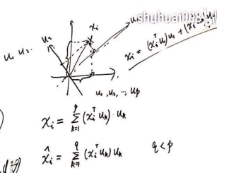

## 	降维 

#### 背景

- Dimensionality Reduction

- 过拟合解决思路：
  - 增加数据，正则化，降维
- 维度灾难：
  - 数据稀疏性
- 降维：
  - 直接降维：特征选择，LASSO
  - 线性降维: PCA,MDS
  - 非线性降维:流形，ISOMAP，LLE
- 样本均值和样本方差
  - Data：$X=(x_1,x_2,...x_N)^T_{n \times p}$
  
  - $sample \; mean: \overline{X_{p \times 1}}=\cfrac{1}{N}\sum^N_{i=1} x_i$
  - $sample\;covariance:S_{p \times p}=\cfrac{1}{N}\sum^{N}_{i = 1}(x_i-\overline{x})(x_i-\overline{x})^T$
  - $\overline{X}=\cfrac{1}{N}X^T 1_{n}$
  
  - $S=\cfrac{1}{N}\sum^N_{i=1}(x_i-\overline{x})(x_i-\overline{x})^T=\cfrac{1}{N} X^T(I_N-\cfrac{1}{N}1_n1^T_n)(I_N-\cfrac{1}{N}1_n1^T_n)^T X$
  - 令$H=(I_N-\cfrac{1}{N}1_n1^T_n)$,称为 centering matrix

#### PCA (Principal Component Analysis)

- 经典PCA："一个中心，两个基本点"
- 一个中心
  - 将一组可能线性**相关**的变量经过正交变换变换为线性**无关**的变量
  - 原始特征空间的重构
- 两个基本点
  - 最大投影方差：将样本从原始空间投影到一组使其**投影方差最大**的基，这组基称为“**主成分**”
  - 最小重构距离

##### 最大投影方差角度

- 目标函数：

  - 样本：X，投影方向：$u_1$,约束:$u_1^Tu_1=1$

  - 投影计算

    - 假设$x_i$与$u_1$的夹角为$\theta$,那么$x_i$在$u_1$的投影计算为：$|x_i|cos\theta$
    - 又$x_i^Tu_1=|x_i||u_1|cos\theta$
    - 所以,在$u_1$的投影计算为：$x_i^Tu_1$

  - 对样本进行均值归一化后的目标函数：
    $$
    J=\cfrac{1}{N}\sum^N_{i=1}u_1^T(x_i-\overline{x})(x_i-\overline{x_i})^Tu_1\\
    =u_1^T\cfrac{1}{N}\sum^N_{i=1}(x_i-\overline{x})(x_i-\overline{x_i})^Tu_1\\
    =u_1^TSu_1\\
    s.t.\; u_1^Tu_1=1
    $$
  
- 极大似然估计：
    $$
    \mathcal{L}(u_1,\lambda) = \;u_1^TSu_1 + \lambda(1 -  u_1^Tu_1)\\
    \cfrac{\partial \mathcal{L}}{\partial u_1}=2Su-2\lambda u_1=0\\
    Su_1=\lambda u_1
    $$
  
- 所以求解目标：
  
  - $u_1$是S的特征向量，$\lambda$是对应的特征值，最大投影方向为协方差矩阵S特征值最大的特征向量的方向

##### 最小重构代价角度

- 重构，如上图所示，如果$x_i$,投影到$u_1$和$u_2$为基。在$u_1$上的投影为:$(x_i^Tu_1)u_1$，在$u_2$上的投影为:$(x_i^Tu_2)u_2$
  - 重构可得:$x_i=(x_i^Tu_1)u_1+(x_i^Tu_2)u_2$
- 推广到高维可得，$x_i$的重构公式可以表示为：
  - 原向量重构表示：$x_i=\sum_{k=1}^p(x_i^Tu_k)u_k$
  - 降维后的向量重构表示为：$\hat{x_i}=\sum_{k=1}^q(x_i^Tu_k)u_k$

- 重构最小代价表示为：
  $$
  \begin{align}
  J&=\cfrac{1}{N}\sum_{i=1}^N||x_i-\hat{x_i}||^2\\
  &=\cfrac{1}{N}\sum_{i=1}^N||\sum_{k=q+1}^p(x_i^Tu_k)u_k||^2\\
  &=\cfrac{1}{N} \sum_{i=1}^N\sum_{i=q+1}^p(x_i^Tu_k)^2\\
  &\triangleq \sum_{i=1}^N \cfrac{1}{N}\sum_{k=q+1}^{p}((x_i-\overline{x})^Tu_k)^2\\
  &=\sum_{k=q+1}^{p}\sum_{i=1}^N \cfrac{1}{N}((x_i-\overline{x})^Tu_k)^2\\
  &=\sum_{k=q+1}^{p} u_k^T \cdot S \cdot u_k
  \end{align}
  $$
  - 最小化重构代价：

  - $$
    u_k=argmin \sum_{k=q+1}^p u_k^T \cdot S \cdot u_k\\
    s.t. \;\; u_k^Tu_k=1
    $$

  - $J= \sum_{k=q+1}^{p} \lambda$,取最小几个特征值

##### SVD角度 

- 直接对中心化的数据进行SVD分解：$HX=U\Sigma V^T$

- 故
  $$
  \begin{align}
  S
  &=X^THX\\
  &=X^TH^THX = \cfrac{1}{N}V\Sigma^T \Sigma V^T
  \end{align}
  $$
  
- 因此，我们直接对中心化后的数据集进行 SVD，就可以得到特征值和特征向量$V$，在新坐标系中的坐标就是：$HX\cdot V$

#### PCoA  主坐标分析

- $T=HXX^TH^T=U\Sigma \Sigma^T U^T$
- $TU\Sigma = U\Sigma(\Sigma^T\Sigma)$,$U \Sigma$是特征向量组成的特征矩阵

- 于是可以直接得到坐标。这两种方法都可以得到主成分，但是由于方差矩阵是$p \times p$ 的，而$T$是$n \times n$ 的，所以对样本量较少的时候可以采用 PCoA的方法。

#### P-PCA 概率主成分分析

- 假设：
  - $x \in \mathcal{R}^p$,$z \in \mathcal{R}^q$,$q < p$

    - 可以认为 x是观测数据，z是隐变量, 可以用线性高斯模型进行建模

    - $$
      令
      z \sim N(0_q,I_q) \\
      x = wz + \mu + \epsilon \\
      \epsilon \sim N(0, \sigma^2 I_p)\\
      \epsilon \bot  z
      $$
      
    - 在模型学习过程可以利用EM算法，在推理过程跟线性高斯模型类似
