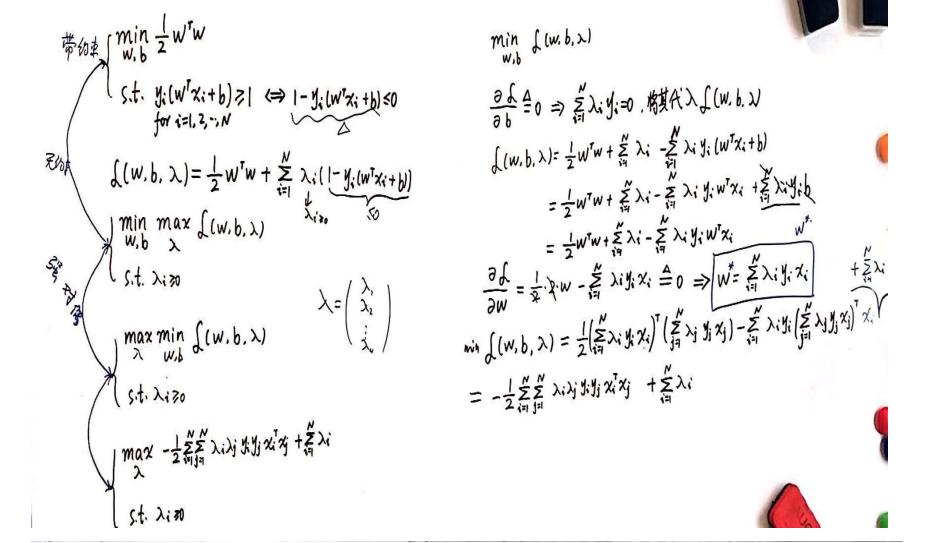

## SVM 支持向量机

**SVM 有三宝：间隔，对偶，核技巧**

#### SVM 分类

- hard-margin SVM
- soft-margin SVM
- kernel SVM

#### hard-margin SVM

##### SVM模型：判定模型

- 存在一个超平面：$w^Tx+b$能够区分开正负类
- SVM的目标是在能够将正负样本区分开的平面中选取一个最好的：泛化性能最强的
- 最大间隔分类器：max margin(w,b) s.t. $y_i(wx_i + b) > 0$ 

- 求解

$$
max_{w,b}min_{x_i}\cfrac{|w^Tx_i+b|}{||w||}\\
\Rightarrow max_{w,b}\cfrac{1}{||w||}\\
\Rightarrow min_{w,b} \cfrac{1}{2}w^Tw\\
s.t. y_i(wx_i+b) \ge1
$$

- SVM的求解是一个二次规划问题，可以用QP直接求解，当维度或者样本数过高无法直接求解

##### SVM的对偶问题

- $$
  \mathcal{L}(w,b,\lambda)=\cfrac{1}{2}w^Tw+\sum_{i=1}^{N}\lambda_i(1-  y_i(wx_i+b))\\
  $$

- 对偶问题：带约束（对w,b的约束）的问题转换为无约束问题，两者等价

- $$
  min_{w,b}max_{\lambda} \mathcal{L}(w,b,\lambda)\\
  s.t. \lambda_i \ge 0
  $$

- 为了方便求解，将min 和max顺序调换，得到强对偶关系

  - 弱对偶关系$max\; min \mathcal{L} \le min\; max \mathcal{L}$
  - 凸优化+slater条件 $\rightarrow$ 强对偶

- $$
  max_{\lambda}min_{w,b}\mathcal(w,b,\lambda)\\
  s.t. \lambda_i \ge 0
  $$

- 推导

  - $\cfrac{\part \mathcal{L}}{\part b}=-\sum_{i=1}^{N} \lambda_iy_i=0 \Rightarrow  \sum_{i=1}^{N} \lambda_iy_i=0$
  - $\cfrac{\part \mathcal{L}}{\part w}=w-\sum_{i=1}^N \lambda_i y_ix_i = 0 \Rightarrow w = \sum_{i=1}^N \lambda_i y_ix_i$ 
  - 将两个条件代入

  - $$
    \begin{align}
    min_{w,b}\mathcal{L}(w,b,\lambda) 
    & = \cfrac{1}{2}(\sum_{i=1}^N \lambda_iy_ix_i)^T（\sum_{j=1}^{N}\lambda_jy_jx_j) - \sum_{i=1}^N \lambda_iy_i(\sum_{j=1}^N \lambda_jy_jx_j)^Tx_i + \sum_{i=1}^N\lambda_i\\
    & = -\cfrac{1}{2}\sum_{i=1}^N\sum_{j=1}^N\lambda_i\lambda_jy_iy_jx_iTx_j+\sum_{i=1}^N \lambda_i
    \end{align}
    $$

  

#### soft SVM

- SVM的loss函数,hingle loss:$$loss = max\{0,1-y_i(w^Tx_i+b)\}$$

目标函数
$$
min_{w,b}\cfrac{1}{2} w^Tw + C\sum_{i=1}^N \zeta_i \\
s.t.\; y_i(w^Tx_i+b) \ge 1-\zeta_i\\
\zeta_i \ge 0
$$

### 问题

- #### 为什么会使用对偶问题对SVM求解

  - 原问题:$argmin_{w,b}max_{\lambda} L(w,b,\lambda_i) s.t. \; \lambda_i \geq 0$

  - 对偶问题：$max_{\lambda_i} min_{w,b} L(w,b,\lambda_i) s.t. \; \lambda_i \geq 0$

  - 原问题是先对 $\lambda$求解再求解$w,b$,对偶问题则相反，如果不先消去$w,b$,无法得到内积形式
  - 原问题的最后求解是对w,b进行求解，其维数为训练样本的特征维数+1，对偶问题最后是对 $\lambda$求解，其维数（个数）等于样本的个数，所以svm对于高维空间中较稀疏的样本表现较好

