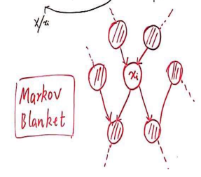

### 概率图

#### 大纲

##### 表示 Representation

- 有向图（Bayes Network）
- 高斯图 (连续)：Gaussian BN/MN
- 无向图 (Markov Network)

##### 推断 Inference

- 精确推断
- 近似推断
  - 确定性近似：变分推断
  - 随机近似：MCMC

##### 学习 Learning

- 参数学习
  - 完备数据
    - 有向
    - 无向
  - 隐变量：EM
- 结构学习

##### 概率论基础

- 假设数据本身是**高维(多元)的随机变量**:$P(x_1,x_2,...x_n)$
- 通过$P(x_1,x_2,...x_n)$可以求解:
  - 边缘概率: $P(x_1)$
  - 条件概率:$P(x_1|x_2)$

- 计算法则：
  - sum rule: $P(x_1) = \int P(x_1,x_2) dx_2$
  - product rule : $P(x_1,x_2)=P(x_1)P(x_2|x_1)=P(x_2)P(x_1|x_2)$ 
  - chain rule:$P(x_1,x_2,...x_n)=\prod_{i=1}^n(x_i|x_1,x_2,...x_{i-1})$
  - bayes rule: $P(x_2|x_1)=\cfrac{P(x_1,x_2)}{P(x_1)}=\cfrac{P(x_1,x_2)}{\int P(x_1,x_2)dx_2}=\cfrac{P(x_1|x_2)P(x_2)}{\int P(x_1|x_2)P(x_2)dx_2}$

- 困难：维度高，计算困难，$P(x_1,x_2,..,x_n)$计算量太大
- 解决思路：**条件独立性**：$x_A \perp x_B |x_C$,$x_A, x_B ,x_C$是三个集合
  - 简化，条件独立假设，$P(x_1,x_2,...x_n)=\prod_{i=1}^np(x_1)$
    - 朴素贝叶斯假设:$P(x|y)=\prod_{i=1}^np(x_1|y)$
  - 马尔可夫假设：$x_j \perp x_{i+1} , j < i$

#### 贝叶斯网络（有向图）

- 因子分解

- 
  $$
  p(x_1,x_2,...,x_p)=\prod_{i=1}^Np(x_i|parent(x_i))
  $$

  - $parent_{x_i}$表示$x_i$的父节点

##### 贝叶斯网络的三种结构

- ![！](data:image/svg+xml;utf8,%3Csvg%20id%3D%22svg%22%20width%3D%2263%22%20xmlns%3D%22http%3A%2F%2Fwww.w3.org%2F2000%2Fsvg%22%20xmlns%3Axlink%3D%22http%3A%2F%2Fwww.w3.org%2F1999%2Fxlink%22%20height%3D%22241%22%20style%3D%22max-width%3A%2063px%3B%22%20viewBox%3D%22-8%20-8%2063%20241%22%3E%3Cstyle%3E%23svg%7Bfont-family%3A%22trebuchet%20ms%22%2Cverdana%2Carial%2Csans-serif%3Bfont-size%3A16px%3Bfill%3A%23333%3B%7D%23svg%20.error-icon%7Bfill%3A%23552222%3B%7D%23svg%20.error-text%7Bfill%3A%23552222%3Bstroke%3A%23552222%3B%7D%23svg%20.edge-thickness-normal%7Bstroke-width%3A2px%3B%7D%23svg%20.edge-thickness-thick%7Bstroke-width%3A3.5px%3B%7D%23svg%20.edge-pattern-solid%7Bstroke-dasharray%3A0%3B%7D%23svg%20.edge-pattern-dashed%7Bstroke-dasharray%3A3%3B%7D%23svg%20.edge-pattern-dotted%7Bstroke-dasharray%3A2%3B%7D%23svg%20.marker%7Bfill%3A%23333333%3Bstroke%3A%23333333%3B%7D%23svg%20.marker.cross%7Bstroke%3A%23333333%3B%7D%23svg%20svg%7Bfont-family%3A%22trebuchet%20ms%22%2Cverdana%2Carial%2Csans-serif%3Bfont-size%3A16px%3B%7D%23svg%20.label%7Bfont-family%3A%22trebuchet%20ms%22%2Cverdana%2Carial%2Csans-serif%3Bcolor%3A%23333%3B%7D%23svg%20.cluster-label%20text%7Bfill%3A%23333%3B%7D%23svg%20.cluster-label%20span%7Bcolor%3A%23333%3B%7D%23svg%20.label%20text%2C%23svg%20span%7Bfill%3A%23333%3Bcolor%3A%23333%3B%7D%23svg%20.node%20rect%2C%23svg%20.node%20circle%2C%23svg%20.node%20ellipse%2C%23svg%20.node%20polygon%2C%23svg%20.node%20path%7Bfill%3A%23ECECFF%3Bstroke%3A%239370DB%3Bstroke-width%3A1px%3B%7D%23svg%20.node%20.label%7Btext-align%3Acenter%3B%7D%23svg%20.node.clickable%7Bcursor%3Apointer%3B%7D%23svg%20.arrowheadPath%7Bfill%3A%23333333%3B%7D%23svg%20.edgePath%20.path%7Bstroke%3A%23333333%3Bstroke-width%3A1.5px%3B%7D%23svg%20.flowchart-link%7Bstroke%3A%23333333%3Bfill%3Anone%3B%7D%23svg%20.edgeLabel%7Bbackground-color%3A%23e8e8e8%3Btext-align%3Acenter%3B%7D%23svg%20.edgeLabel%20rect%7Bopacity%3A0.5%3Bbackground-color%3A%23e8e8e8%3Bfill%3A%23e8e8e8%3B%7D%23svg%20.cluster%20rect%7Bfill%3A%23ffffde%3Bstroke%3A%23aaaa33%3Bstroke-width%3A1px%3B%7D%23svg%20.cluster%20text%7Bfill%3A%23333%3B%7D%23svg%20.cluster%20span%7Bcolor%3A%23333%3B%7D%23svg%20div.mermaidTooltip%7Bposition%3Aabsolute%3Btext-align%3Acenter%3Bmax-width%3A200px%3Bpadding%3A2px%3Bfont-family%3A%22trebuchet%20ms%22%2Cverdana%2Carial%2Csans-serif%3Bfont-size%3A12px%3Bbackground%3Ahsl(80%2C100%25%2C96.2745098039%25)%3Bborder%3A1px%20solid%20%23aaaa33%3Bborder-radius%3A2px%3Bpointer-events%3Anone%3Bz-index%3A100%3B%7D%23svg%20.today%7Bdisplay%3Anone%3B%7D%23svg%20.label%20foreignObject%7Boverflow%3Avisible%3B%7D%23svg%3Aroot%7B--mermaid-font-family%3A%22trebuchet%20ms%22%2Cverdana%2Carial%2Csans-serif%3B%7D%23svg%20flowchart%7Bfill%3Aapa%3B%7D%3C%2Fstyle%3E%3Cg%3E%3Cg%20class%3D%22output%22%3E%3Cg%20class%3D%22clusters%22%3E%3C%2Fg%3E%3Cg%20class%3D%22edgePaths%22%3E%3Cg%20class%3D%22edgePath%20LS-A%20LE-B%22%20id%3D%22L-A-B%22%20style%3D%22opacity%3A%201%3B%22%3E%3Cpath%20class%3D%22path%22%20d%3D%22M27.5%2C47L27.5%2C72L27.5%2C97%22%20marker-end%3D%22url(%23arrowhead12)%22%20style%3D%22fill%3Anone%22%3E%3C%2Fpath%3E%3Cdefs%3E%3Cmarker%20id%3D%22arrowhead12%22%20viewBox%3D%220%200%2010%2010%22%20refX%3D%229%22%20refY%3D%225%22%20markerUnits%3D%22strokeWidth%22%20markerWidth%3D%228%22%20markerHeight%3D%226%22%20orient%3D%22auto%22%3E%3Cpath%20d%3D%22M%200%200%20L%2010%205%20L%200%2010%20z%22%20class%3D%22arrowheadPath%22%20style%3D%22stroke-width%3A%201%3B%20stroke-dasharray%3A%201%2C%200%3B%22%3E%3C%2Fpath%3E%3C%2Fmarker%3E%3C%2Fdefs%3E%3C%2Fg%3E%3Cg%20class%3D%22edgePath%20LS-B%20LE-C%22%20id%3D%22L-B-C%22%20style%3D%22opacity%3A%201%3B%22%3E%3Cpath%20class%3D%22path%22%20d%3D%22M27.5%2C136L27.5%2C161L27.5%2C186%22%20marker-end%3D%22url(%23arrowhead13)%22%20style%3D%22fill%3Anone%22%3E%3C%2Fpath%3E%3Cdefs%3E%3Cmarker%20id%3D%22arrowhead13%22%20viewBox%3D%220%200%2010%2010%22%20refX%3D%229%22%20refY%3D%225%22%20markerUnits%3D%22strokeWidth%22%20markerWidth%3D%228%22%20markerHeight%3D%226%22%20orient%3D%22auto%22%3E%3Cpath%20d%3D%22M%200%200%20L%2010%205%20L%200%2010%20z%22%20class%3D%22arrowheadPath%22%20style%3D%22stroke-width%3A%201%3B%20stroke-dasharray%3A%201%2C%200%3B%22%3E%3C%2Fpath%3E%3C%2Fmarker%3E%3C%2Fdefs%3E%3C%2Fg%3E%3C%2Fg%3E%3Cg%20class%3D%22edgeLabels%22%3E%3Cg%20class%3D%22edgeLabel%22%20transform%3D%22%22%20style%3D%22opacity%3A%201%3B%22%3E%3Cg%20transform%3D%22translate(0%2C0)%22%20class%3D%22label%22%3E%3Crect%20rx%3D%220%22%20ry%3D%220%22%20width%3D%220%22%20height%3D%220%22%3E%3C%2Frect%3E%3CforeignObject%20width%3D%220%22%20height%3D%220%22%3E%3Cdiv%20xmlns%3D%22http%3A%2F%2Fwww.w3.org%2F1999%2Fxhtml%22%20style%3D%22display%3A%20inline-block%3B%20white-space%3A%20nowrap%3B%22%3E%3Cspan%20id%3D%22L-L-A-B%22%20class%3D%22edgeLabel%20L-LS-A'%20L-LE-B%22%3E%3C%2Fspan%3E%3C%2Fdiv%3E%3C%2FforeignObject%3E%3C%2Fg%3E%3C%2Fg%3E%3Cg%20class%3D%22edgeLabel%22%20transform%3D%22%22%20style%3D%22opacity%3A%201%3B%22%3E%3Cg%20transform%3D%22translate(0%2C0)%22%20class%3D%22label%22%3E%3Crect%20rx%3D%220%22%20ry%3D%220%22%20width%3D%220%22%20height%3D%220%22%3E%3C%2Frect%3E%3CforeignObject%20width%3D%220%22%20height%3D%220%22%3E%3Cdiv%20xmlns%3D%22http%3A%2F%2Fwww.w3.org%2F1999%2Fxhtml%22%20style%3D%22display%3A%20inline-block%3B%20white-space%3A%20nowrap%3B%22%3E%3Cspan%20id%3D%22L-L-B-C%22%20class%3D%22edgeLabel%20L-LS-B'%20L-LE-C%22%3E%3C%2Fspan%3E%3C%2Fdiv%3E%3C%2FforeignObject%3E%3C%2Fg%3E%3C%2Fg%3E%3C%2Fg%3E%3Cg%20class%3D%22nodes%22%3E%3Cg%20class%3D%22node%20default%22%20id%3D%22flowchart-A-4%22%20transform%3D%22translate(27.5%2C27.5)%22%20style%3D%22opacity%3A%201%3B%22%3E%3Ccircle%20x%3D%22-15.5%22%20y%3D%22-19.5%22%20r%3D%2219.5%22%20class%3D%22label-container%22%3E%3C%2Fcircle%3E%3Cg%20class%3D%22label%22%20transform%3D%22translate(0%2C0)%22%3E%3Cg%20transform%3D%22translate(-5.5%2C-9.5)%22%3E%3CforeignObject%20width%3D%2211%22%20height%3D%2219%22%3E%3Cdiv%20xmlns%3D%22http%3A%2F%2Fwww.w3.org%2F1999%2Fxhtml%22%20style%3D%22display%3A%20inline-block%3B%20white-space%3A%20nowrap%3B%22%3EA%3C%2Fdiv%3E%3C%2FforeignObject%3E%3C%2Fg%3E%3C%2Fg%3E%3C%2Fg%3E%3Cg%20class%3D%22node%20default%22%20id%3D%22flowchart-B-5%22%20transform%3D%22translate(27.5%2C116.5)%22%20style%3D%22opacity%3A%201%3B%22%3E%3Ccircle%20x%3D%22-15.5%22%20y%3D%22-19.5%22%20r%3D%2219.5%22%20class%3D%22label-container%22%3E%3C%2Fcircle%3E%3Cg%20class%3D%22label%22%20transform%3D%22translate(0%2C0)%22%3E%3Cg%20transform%3D%22translate(-5.5%2C-9.5)%22%3E%3CforeignObject%20width%3D%2211%22%20height%3D%2219%22%3E%3Cdiv%20xmlns%3D%22http%3A%2F%2Fwww.w3.org%2F1999%2Fxhtml%22%20style%3D%22display%3A%20inline-block%3B%20white-space%3A%20nowrap%3B%22%3EB%3C%2Fdiv%3E%3C%2FforeignObject%3E%3C%2Fg%3E%3C%2Fg%3E%3C%2Fg%3E%3Cg%20class%3D%22node%20default%22%20id%3D%22flowchart-C-7%22%20transform%3D%22translate(27.5%2C205.5)%22%20style%3D%22opacity%3A%201%3B%22%3E%3Ccircle%20x%3D%22-15.5%22%20y%3D%22-19.5%22%20r%3D%2219.5%22%20class%3D%22label-container%22%3E%3C%2Fcircle%3E%3Cg%20class%3D%22label%22%20transform%3D%22translate(0%2C0)%22%3E%3Cg%20transform%3D%22translate(-5.5%2C-9.5)%22%3E%3CforeignObject%20width%3D%2211%22%20height%3D%2219%22%3E%3Cdiv%20xmlns%3D%22http%3A%2F%2Fwww.w3.org%2F1999%2Fxhtml%22%20style%3D%22display%3A%20inline-block%3B%20white-space%3A%20nowrap%3B%22%3EC%3C%2Fdiv%3E%3C%2FforeignObject%3E%3C%2Fg%3E%3C%2Fg%3E%3C%2Fg%3E%3C%2Fg%3E%3C%2Fg%3E%3C%2Fg%3E%3C%2Fsvg%3E)$$p(A,B,C)=p(A)p(B|A)p(C|B)=p(A)p(B|A)p(C|B,A)\Rightarrow p(C|B)=p(C|B,A)\Rightarrow C\perp A|B $$
- ![img](data:image/svg+xml;utf8,%3Csvg%20id%3D%22svg%22%20width%3D%22152%22%20xmlns%3D%22http%3A%2F%2Fwww.w3.org%2F2000%2Fsvg%22%20xmlns%3Axlink%3D%22http%3A%2F%2Fwww.w3.org%2F1999%2Fxlink%22%20height%3D%22152%22%20style%3D%22max-width%3A%20152px%3B%22%20viewBox%3D%22-8%20-8%20152%20152%22%3E%3Cstyle%3E%23svg%7Bfont-family%3A%22trebuchet%20ms%22%2Cverdana%2Carial%2Csans-serif%3Bfont-size%3A16px%3Bfill%3A%23333%3B%7D%23svg%20.error-icon%7Bfill%3A%23552222%3B%7D%23svg%20.error-text%7Bfill%3A%23552222%3Bstroke%3A%23552222%3B%7D%23svg%20.edge-thickness-normal%7Bstroke-width%3A2px%3B%7D%23svg%20.edge-thickness-thick%7Bstroke-width%3A3.5px%3B%7D%23svg%20.edge-pattern-solid%7Bstroke-dasharray%3A0%3B%7D%23svg%20.edge-pattern-dashed%7Bstroke-dasharray%3A3%3B%7D%23svg%20.edge-pattern-dotted%7Bstroke-dasharray%3A2%3B%7D%23svg%20.marker%7Bfill%3A%23333333%3Bstroke%3A%23333333%3B%7D%23svg%20.marker.cross%7Bstroke%3A%23333333%3B%7D%23svg%20svg%7Bfont-family%3A%22trebuchet%20ms%22%2Cverdana%2Carial%2Csans-serif%3Bfont-size%3A16px%3B%7D%23svg%20.label%7Bfont-family%3A%22trebuchet%20ms%22%2Cverdana%2Carial%2Csans-serif%3Bcolor%3A%23333%3B%7D%23svg%20.cluster-label%20text%7Bfill%3A%23333%3B%7D%23svg%20.cluster-label%20span%7Bcolor%3A%23333%3B%7D%23svg%20.label%20text%2C%23svg%20span%7Bfill%3A%23333%3Bcolor%3A%23333%3B%7D%23svg%20.node%20rect%2C%23svg%20.node%20circle%2C%23svg%20.node%20ellipse%2C%23svg%20.node%20polygon%2C%23svg%20.node%20path%7Bfill%3A%23ECECFF%3Bstroke%3A%239370DB%3Bstroke-width%3A1px%3B%7D%23svg%20.node%20.label%7Btext-align%3Acenter%3B%7D%23svg%20.node.clickable%7Bcursor%3Apointer%3B%7D%23svg%20.arrowheadPath%7Bfill%3A%23333333%3B%7D%23svg%20.edgePath%20.path%7Bstroke%3A%23333333%3Bstroke-width%3A1.5px%3B%7D%23svg%20.flowchart-link%7Bstroke%3A%23333333%3Bfill%3Anone%3B%7D%23svg%20.edgeLabel%7Bbackground-color%3A%23e8e8e8%3Btext-align%3Acenter%3B%7D%23svg%20.edgeLabel%20rect%7Bopacity%3A0.5%3Bbackground-color%3A%23e8e8e8%3Bfill%3A%23e8e8e8%3B%7D%23svg%20.cluster%20rect%7Bfill%3A%23ffffde%3Bstroke%3A%23aaaa33%3Bstroke-width%3A1px%3B%7D%23svg%20.cluster%20text%7Bfill%3A%23333%3B%7D%23svg%20.cluster%20span%7Bcolor%3A%23333%3B%7D%23svg%20div.mermaidTooltip%7Bposition%3Aabsolute%3Btext-align%3Acenter%3Bmax-width%3A200px%3Bpadding%3A2px%3Bfont-family%3A%22trebuchet%20ms%22%2Cverdana%2Carial%2Csans-serif%3Bfont-size%3A12px%3Bbackground%3Ahsl(80%2C100%25%2C96.2745098039%25)%3Bborder%3A1px%20solid%20%23aaaa33%3Bborder-radius%3A2px%3Bpointer-events%3Anone%3Bz-index%3A100%3B%7D%23svg%20.today%7Bdisplay%3Anone%3B%7D%23svg%20.label%20foreignObject%7Boverflow%3Avisible%3B%7D%23svg%3Aroot%7B--mermaid-font-family%3A%22trebuchet%20ms%22%2Cverdana%2Carial%2Csans-serif%3B%7D%23svg%20flowchart%7Bfill%3Aapa%3B%7D%3C%2Fstyle%3E%3Cg%3E%3Cg%20class%3D%22output%22%3E%3Cg%20class%3D%22clusters%22%3E%3C%2Fg%3E%3Cg%20class%3D%22edgePaths%22%3E%3Cg%20class%3D%22edgePath%20LS-B%20LE-A%22%20id%3D%22L-B-A%22%20style%3D%22opacity%3A%201%3B%22%3E%3Cpath%20class%3D%22path%22%20d%3D%22M58.211417766862326%2C41.288582233137674L27.5%2C72L27.5%2C97%22%20marker-end%3D%22url(%23arrowhead8)%22%20style%3D%22fill%3Anone%22%3E%3C%2Fpath%3E%3Cdefs%3E%3Cmarker%20id%3D%22arrowhead8%22%20viewBox%3D%220%200%2010%2010%22%20refX%3D%229%22%20refY%3D%225%22%20markerUnits%3D%22strokeWidth%22%20markerWidth%3D%228%22%20markerHeight%3D%226%22%20orient%3D%22auto%22%3E%3Cpath%20d%3D%22M%200%200%20L%2010%205%20L%200%2010%20z%22%20class%3D%22arrowheadPath%22%20style%3D%22stroke-width%3A%201%3B%20stroke-dasharray%3A%201%2C%200%3B%22%3E%3C%2Fpath%3E%3C%2Fmarker%3E%3C%2Fdefs%3E%3C%2Fg%3E%3Cg%20class%3D%22edgePath%20LS-B%20LE-C%22%20id%3D%22L-B-C%22%20style%3D%22opacity%3A%201%3B%22%3E%3Cpath%20class%3D%22path%22%20d%3D%22M85.78858223313767%2C41.288582233137674L116.5%2C72L116.5%2C97%22%20marker-end%3D%22url(%23arrowhead9)%22%20style%3D%22fill%3Anone%22%3E%3C%2Fpath%3E%3Cdefs%3E%3Cmarker%20id%3D%22arrowhead9%22%20viewBox%3D%220%200%2010%2010%22%20refX%3D%229%22%20refY%3D%225%22%20markerUnits%3D%22strokeWidth%22%20markerWidth%3D%228%22%20markerHeight%3D%226%22%20orient%3D%22auto%22%3E%3Cpath%20d%3D%22M%200%200%20L%2010%205%20L%200%2010%20z%22%20class%3D%22arrowheadPath%22%20style%3D%22stroke-width%3A%201%3B%20stroke-dasharray%3A%201%2C%200%3B%22%3E%3C%2Fpath%3E%3C%2Fmarker%3E%3C%2Fdefs%3E%3C%2Fg%3E%3C%2Fg%3E%3Cg%20class%3D%22edgeLabels%22%3E%3Cg%20class%3D%22edgeLabel%22%20transform%3D%22%22%20style%3D%22opacity%3A%201%3B%22%3E%3Cg%20transform%3D%22translate(0%2C0)%22%20class%3D%22label%22%3E%3Crect%20rx%3D%220%22%20ry%3D%220%22%20width%3D%220%22%20height%3D%220%22%3E%3C%2Frect%3E%3CforeignObject%20width%3D%220%22%20height%3D%220%22%3E%3Cdiv%20xmlns%3D%22http%3A%2F%2Fwww.w3.org%2F1999%2Fxhtml%22%20style%3D%22display%3A%20inline-block%3B%20white-space%3A%20nowrap%3B%22%3E%3Cspan%20id%3D%22L-L-B-A%22%20class%3D%22edgeLabel%20L-LS-B'%20L-LE-A%22%3E%3C%2Fspan%3E%3C%2Fdiv%3E%3C%2FforeignObject%3E%3C%2Fg%3E%3C%2Fg%3E%3Cg%20class%3D%22edgeLabel%22%20transform%3D%22%22%20style%3D%22opacity%3A%201%3B%22%3E%3Cg%20transform%3D%22translate(0%2C0)%22%20class%3D%22label%22%3E%3Crect%20rx%3D%220%22%20ry%3D%220%22%20width%3D%220%22%20height%3D%220%22%3E%3C%2Frect%3E%3CforeignObject%20width%3D%220%22%20height%3D%220%22%3E%3Cdiv%20xmlns%3D%22http%3A%2F%2Fwww.w3.org%2F1999%2Fxhtml%22%20style%3D%22display%3A%20inline-block%3B%20white-space%3A%20nowrap%3B%22%3E%3Cspan%20id%3D%22L-L-B-C%22%20class%3D%22edgeLabel%20L-LS-B'%20L-LE-C%22%3E%3C%2Fspan%3E%3C%2Fdiv%3E%3C%2FforeignObject%3E%3C%2Fg%3E%3C%2Fg%3E%3C%2Fg%3E%3Cg%20class%3D%22nodes%22%3E%3Cg%20class%3D%22node%20default%22%20id%3D%22flowchart-B-4%22%20transform%3D%22translate(72%2C27.5)%22%20style%3D%22opacity%3A%201%3B%22%3E%3Ccircle%20x%3D%22-15.5%22%20y%3D%22-19.5%22%20r%3D%2219.5%22%20class%3D%22label-container%22%3E%3C%2Fcircle%3E%3Cg%20class%3D%22label%22%20transform%3D%22translate(0%2C0)%22%3E%3Cg%20transform%3D%22translate(-5.5%2C-9.5)%22%3E%3CforeignObject%20width%3D%2211%22%20height%3D%2219%22%3E%3Cdiv%20xmlns%3D%22http%3A%2F%2Fwww.w3.org%2F1999%2Fxhtml%22%20style%3D%22display%3A%20inline-block%3B%20white-space%3A%20nowrap%3B%22%3EB%3C%2Fdiv%3E%3C%2FforeignObject%3E%3C%2Fg%3E%3C%2Fg%3E%3C%2Fg%3E%3Cg%20class%3D%22node%20default%22%20id%3D%22flowchart-A-5%22%20transform%3D%22translate(27.5%2C116.5)%22%20style%3D%22opacity%3A%201%3B%22%3E%3Ccircle%20x%3D%22-15.5%22%20y%3D%22-19.5%22%20r%3D%2219.5%22%20class%3D%22label-container%22%3E%3C%2Fcircle%3E%3Cg%20class%3D%22label%22%20transform%3D%22translate(0%2C0)%22%3E%3Cg%20transform%3D%22translate(-5.5%2C-9.5)%22%3E%3CforeignObject%20width%3D%2211%22%20height%3D%2219%22%3E%3Cdiv%20xmlns%3D%22http%3A%2F%2Fwww.w3.org%2F1999%2Fxhtml%22%20style%3D%22display%3A%20inline-block%3B%20white-space%3A%20nowrap%3B%22%3EA%3C%2Fdiv%3E%3C%2FforeignObject%3E%3C%2Fg%3E%3C%2Fg%3E%3C%2Fg%3E%3Cg%20class%3D%22node%20default%22%20id%3D%22flowchart-C-7%22%20transform%3D%22translate(116.5%2C116.5)%22%20style%3D%22opacity%3A%201%3B%22%3E%3Ccircle%20x%3D%22-15.5%22%20y%3D%22-19.5%22%20r%3D%2219.5%22%20class%3D%22label-container%22%3E%3C%2Fcircle%3E%3Cg%20class%3D%22label%22%20transform%3D%22translate(0%2C0)%22%3E%3Cg%20transform%3D%22translate(-5.5%2C-9.5)%22%3E%3CforeignObject%20width%3D%2211%22%20height%3D%2219%22%3E%3Cdiv%20xmlns%3D%22http%3A%2F%2Fwww.w3.org%2F1999%2Fxhtml%22%20style%3D%22display%3A%20inline-block%3B%20white-space%3A%20nowrap%3B%22%3EC%3C%2Fdiv%3E%3C%2FforeignObject%3E%3C%2Fg%3E%3C%2Fg%3E%3C%2Fg%3E%3C%2Fg%3E%3C%2Fg%3E%3C%2Fg%3E%3C%2Fsvg%3E)$$p(A,B,C)=p(B)p(A|B)p(C|B)=p(B)p(A|B)p(C|B.A)\Rightarrow A\perp C|B$$

- ![img](data:image/svg+xml;utf8,%3Csvg%20id%3D%22svg%22%20width%3D%22152%22%20xmlns%3D%22http%3A%2F%2Fwww.w3.org%2F2000%2Fsvg%22%20xmlns%3Axlink%3D%22http%3A%2F%2Fwww.w3.org%2F1999%2Fxlink%22%20height%3D%22152%22%20style%3D%22max-width%3A%20152px%3B%22%20viewBox%3D%22-8%20-8%20152%20152%22%3E%3Cstyle%3E%23svg%7Bfont-family%3A%22trebuchet%20ms%22%2Cverdana%2Carial%2Csans-serif%3Bfont-size%3A16px%3Bfill%3A%23333%3B%7D%23svg%20.error-icon%7Bfill%3A%23552222%3B%7D%23svg%20.error-text%7Bfill%3A%23552222%3Bstroke%3A%23552222%3B%7D%23svg%20.edge-thickness-normal%7Bstroke-width%3A2px%3B%7D%23svg%20.edge-thickness-thick%7Bstroke-width%3A3.5px%3B%7D%23svg%20.edge-pattern-solid%7Bstroke-dasharray%3A0%3B%7D%23svg%20.edge-pattern-dashed%7Bstroke-dasharray%3A3%3B%7D%23svg%20.edge-pattern-dotted%7Bstroke-dasharray%3A2%3B%7D%23svg%20.marker%7Bfill%3A%23333333%3Bstroke%3A%23333333%3B%7D%23svg%20.marker.cross%7Bstroke%3A%23333333%3B%7D%23svg%20svg%7Bfont-family%3A%22trebuchet%20ms%22%2Cverdana%2Carial%2Csans-serif%3Bfont-size%3A16px%3B%7D%23svg%20.label%7Bfont-family%3A%22trebuchet%20ms%22%2Cverdana%2Carial%2Csans-serif%3Bcolor%3A%23333%3B%7D%23svg%20.cluster-label%20text%7Bfill%3A%23333%3B%7D%23svg%20.cluster-label%20span%7Bcolor%3A%23333%3B%7D%23svg%20.label%20text%2C%23svg%20span%7Bfill%3A%23333%3Bcolor%3A%23333%3B%7D%23svg%20.node%20rect%2C%23svg%20.node%20circle%2C%23svg%20.node%20ellipse%2C%23svg%20.node%20polygon%2C%23svg%20.node%20path%7Bfill%3A%23ECECFF%3Bstroke%3A%239370DB%3Bstroke-width%3A1px%3B%7D%23svg%20.node%20.label%7Btext-align%3Acenter%3B%7D%23svg%20.node.clickable%7Bcursor%3Apointer%3B%7D%23svg%20.arrowheadPath%7Bfill%3A%23333333%3B%7D%23svg%20.edgePath%20.path%7Bstroke%3A%23333333%3Bstroke-width%3A1.5px%3B%7D%23svg%20.flowchart-link%7Bstroke%3A%23333333%3Bfill%3Anone%3B%7D%23svg%20.edgeLabel%7Bbackground-color%3A%23e8e8e8%3Btext-align%3Acenter%3B%7D%23svg%20.edgeLabel%20rect%7Bopacity%3A0.5%3Bbackground-color%3A%23e8e8e8%3Bfill%3A%23e8e8e8%3B%7D%23svg%20.cluster%20rect%7Bfill%3A%23ffffde%3Bstroke%3A%23aaaa33%3Bstroke-width%3A1px%3B%7D%23svg%20.cluster%20text%7Bfill%3A%23333%3B%7D%23svg%20.cluster%20span%7Bcolor%3A%23333%3B%7D%23svg%20div.mermaidTooltip%7Bposition%3Aabsolute%3Btext-align%3Acenter%3Bmax-width%3A200px%3Bpadding%3A2px%3Bfont-family%3A%22trebuchet%20ms%22%2Cverdana%2Carial%2Csans-serif%3Bfont-size%3A12px%3Bbackground%3Ahsl(80%2C100%25%2C96.2745098039%25)%3Bborder%3A1px%20solid%20%23aaaa33%3Bborder-radius%3A2px%3Bpointer-events%3Anone%3Bz-index%3A100%3B%7D%23svg%20.today%7Bdisplay%3Anone%3B%7D%23svg%20.label%20foreignObject%7Boverflow%3Avisible%3B%7D%23svg%3Aroot%7B--mermaid-font-family%3A%22trebuchet%20ms%22%2Cverdana%2Carial%2Csans-serif%3B%7D%23svg%20flowchart%7Bfill%3Aapa%3B%7D%3C%2Fstyle%3E%3Cg%3E%3Cg%20class%3D%22output%22%3E%3Cg%20class%3D%22clusters%22%3E%3C%2Fg%3E%3Cg%20class%3D%22edgePaths%22%3E%3Cg%20class%3D%22edgePath%20LS-A%20LE-B%22%20id%3D%22L-A-B%22%20style%3D%22opacity%3A%201%3B%22%3E%3Cpath%20class%3D%22path%22%20d%3D%22M27.5%2C47L27.5%2C72L58.211417766862326%2C102.71141776686233%22%20marker-end%3D%22url(%23arrowhead8)%22%20style%3D%22fill%3Anone%22%3E%3C%2Fpath%3E%3Cdefs%3E%3Cmarker%20id%3D%22arrowhead8%22%20viewBox%3D%220%200%2010%2010%22%20refX%3D%229%22%20refY%3D%225%22%20markerUnits%3D%22strokeWidth%22%20markerWidth%3D%228%22%20markerHeight%3D%226%22%20orient%3D%22auto%22%3E%3Cpath%20d%3D%22M%200%200%20L%2010%205%20L%200%2010%20z%22%20class%3D%22arrowheadPath%22%20style%3D%22stroke-width%3A%201%3B%20stroke-dasharray%3A%201%2C%200%3B%22%3E%3C%2Fpath%3E%3C%2Fmarker%3E%3C%2Fdefs%3E%3C%2Fg%3E%3Cg%20class%3D%22edgePath%20LS-C%20LE-B%22%20id%3D%22L-C-B%22%20style%3D%22opacity%3A%201%3B%22%3E%3Cpath%20class%3D%22path%22%20d%3D%22M116.5%2C47L116.5%2C72L85.78858223313767%2C102.71141776686233%22%20marker-end%3D%22url(%23arrowhead9)%22%20style%3D%22fill%3Anone%22%3E%3C%2Fpath%3E%3Cdefs%3E%3Cmarker%20id%3D%22arrowhead9%22%20viewBox%3D%220%200%2010%2010%22%20refX%3D%229%22%20refY%3D%225%22%20markerUnits%3D%22strokeWidth%22%20markerWidth%3D%228%22%20markerHeight%3D%226%22%20orient%3D%22auto%22%3E%3Cpath%20d%3D%22M%200%200%20L%2010%205%20L%200%2010%20z%22%20class%3D%22arrowheadPath%22%20style%3D%22stroke-width%3A%201%3B%20stroke-dasharray%3A%201%2C%200%3B%22%3E%3C%2Fpath%3E%3C%2Fmarker%3E%3C%2Fdefs%3E%3C%2Fg%3E%3C%2Fg%3E%3Cg%20class%3D%22edgeLabels%22%3E%3Cg%20class%3D%22edgeLabel%22%20transform%3D%22%22%20style%3D%22opacity%3A%201%3B%22%3E%3Cg%20transform%3D%22translate(0%2C0)%22%20class%3D%22label%22%3E%3Crect%20rx%3D%220%22%20ry%3D%220%22%20width%3D%220%22%20height%3D%220%22%3E%3C%2Frect%3E%3CforeignObject%20width%3D%220%22%20height%3D%220%22%3E%3Cdiv%20xmlns%3D%22http%3A%2F%2Fwww.w3.org%2F1999%2Fxhtml%22%20style%3D%22display%3A%20inline-block%3B%20white-space%3A%20nowrap%3B%22%3E%3Cspan%20id%3D%22L-L-A-B%22%20class%3D%22edgeLabel%20L-LS-A'%20L-LE-B%22%3E%3C%2Fspan%3E%3C%2Fdiv%3E%3C%2FforeignObject%3E%3C%2Fg%3E%3C%2Fg%3E%3Cg%20class%3D%22edgeLabel%22%20transform%3D%22%22%20style%3D%22opacity%3A%201%3B%22%3E%3Cg%20transform%3D%22translate(0%2C0)%22%20class%3D%22label%22%3E%3Crect%20rx%3D%220%22%20ry%3D%220%22%20width%3D%220%22%20height%3D%220%22%3E%3C%2Frect%3E%3CforeignObject%20width%3D%220%22%20height%3D%220%22%3E%3Cdiv%20xmlns%3D%22http%3A%2F%2Fwww.w3.org%2F1999%2Fxhtml%22%20style%3D%22display%3A%20inline-block%3B%20white-space%3A%20nowrap%3B%22%3E%3Cspan%20id%3D%22L-L-C-B%22%20class%3D%22edgeLabel%20L-LS-C'%20L-LE-B%22%3E%3C%2Fspan%3E%3C%2Fdiv%3E%3C%2FforeignObject%3E%3C%2Fg%3E%3C%2Fg%3E%3C%2Fg%3E%3Cg%20class%3D%22nodes%22%3E%3Cg%20class%3D%22node%20default%22%20id%3D%22flowchart-A-4%22%20transform%3D%22translate(27.5%2C27.5)%22%20style%3D%22opacity%3A%201%3B%22%3E%3Ccircle%20x%3D%22-15.5%22%20y%3D%22-19.5%22%20r%3D%2219.5%22%20class%3D%22label-container%22%3E%3C%2Fcircle%3E%3Cg%20class%3D%22label%22%20transform%3D%22translate(0%2C0)%22%3E%3Cg%20transform%3D%22translate(-5.5%2C-9.5)%22%3E%3CforeignObject%20width%3D%2211%22%20height%3D%2219%22%3E%3Cdiv%20xmlns%3D%22http%3A%2F%2Fwww.w3.org%2F1999%2Fxhtml%22%20style%3D%22display%3A%20inline-block%3B%20white-space%3A%20nowrap%3B%22%3EA%3C%2Fdiv%3E%3C%2FforeignObject%3E%3C%2Fg%3E%3C%2Fg%3E%3C%2Fg%3E%3Cg%20class%3D%22node%20default%22%20id%3D%22flowchart-B-5%22%20transform%3D%22translate(72%2C116.5)%22%20style%3D%22opacity%3A%201%3B%22%3E%3Ccircle%20x%3D%22-15.5%22%20y%3D%22-19.5%22%20r%3D%2219.5%22%20class%3D%22label-container%22%3E%3C%2Fcircle%3E%3Cg%20class%3D%22label%22%20transform%3D%22translate(0%2C0)%22%3E%3Cg%20transform%3D%22translate(-5.5%2C-9.5)%22%3E%3CforeignObject%20width%3D%2211%22%20height%3D%2219%22%3E%3Cdiv%20xmlns%3D%22http%3A%2F%2Fwww.w3.org%2F1999%2Fxhtml%22%20style%3D%22display%3A%20inline-block%3B%20white-space%3A%20nowrap%3B%22%3EB%3C%2Fdiv%3E%3C%2FforeignObject%3E%3C%2Fg%3E%3C%2Fg%3E%3C%2Fg%3E%3Cg%20class%3D%22node%20default%22%20id%3D%22flowchart-C-6%22%20transform%3D%22translate(116.5%2C27.5)%22%20style%3D%22opacity%3A%201%3B%22%3E%3Ccircle%20x%3D%22-15.5%22%20y%3D%22-19.5%22%20r%3D%2219.5%22%20class%3D%22label-container%22%3E%3C%2Fcircle%3E%3Cg%20class%3D%22label%22%20transform%3D%22translate(0%2C0)%22%3E%3Cg%20transform%3D%22translate(-5.5%2C-9.5)%22%3E%3CforeignObject%20width%3D%2211%22%20height%3D%2219%22%3E%3Cdiv%20xmlns%3D%22http%3A%2F%2Fwww.w3.org%2F1999%2Fxhtml%22%20style%3D%22display%3A%20inline-block%3B%20white-space%3A%20nowrap%3B%22%3EC%3C%2Fdiv%3E%3C%2FforeignObject%3E%3C%2Fg%3E%3C%2Fg%3E%3C%2Fg%3E%3C%2Fg%3E%3C%2Fg%3E%3C%2Fg%3E%3C%2Fsvg%3E)A,Cz在没有B的情况下独立，当B被观测，A，C直接不相互独立

##### D-划分 (D-seperation)

- 马尔可夫毯 markov blanket 

- $x_i$的概率只和这个马尔可夫毯范围内的概率有关

##### 贝叶斯网络的实例

- 单一：Naive Bayes $\rightarrow p(y_1|x_i)=\prod_{i=1}^N(x_i|y_1)p(y_1)$ 
- 混合：$GMM\rightarrow$
  - 混合高斯模型用来聚类	
- 时间：
  - $markov\; chain$
  - $gaussian\; process$无限维度的高斯分布
- 混合/时间
  - HMM：离散
  - LDS（卡尔曼滤波）：连续，线性
  - 
- 连续
  - $Gaussian \; Bayes \; network$

##### 马尔可夫随机场

- 条件独立性
  - 全局markov性
  - 局部markov性
  - 成对markov性
- 团的概念
  - 团是一个节点集合，团中的节点与其他节点都相互连通
  - 最大团是一个无法再增加节点的团
- 马尔科夫网络的联合概率分布
  - 定义:$P(x) = \cfrac{1}{Z} \prod_{Q \in C} \phi_Q(x_Q)$
  - C为图中最大团所构成的集合,$Z = \sum_x\prod_{Q \in C} \phi_Q(x_Q)$
  - $ \phi_Q$是团$Q$对应的势函数，**非负的**，并且应该在概率较大的变量上取得较大的值，例如指数函数
    - $\phi_Q(x_Q)=e^{-H_Q(x_Q)}$
    - 其中$H_Q(x_Q)=\sum_{u,v\in Q,u \neq v} \alpha_{u,v}x_ux_v+\sum_{v\in Q}\beta_vx_v$
  - 所有节点$x=\{x_1,x_2,...,x_n\}$所构成的子集，如果子集内任意两个节点都存在边，则这个子集中所有节点构成了一个团，如果这个子集中加入任意其他节点，都不能构成一个团，称这样的子集构成了一个最大团

#### 推断

**推断就是为了求概率**

- Inference分类
  - 精确推断
    - 变量消除法（variable elimination ,VE）
    - Belief Propagation（信念传播）
    - Junction Tree Algorithm
  - 近似推断
    - mente Carlo Inference: Importance Sampling ,MCMC
    - variational Inference
