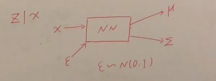

## VAE

#### VAE原理

- 是变分推断和神经网络的结合，也是概率图模型
- 正常求后验$p(X|Z)=\cfrac{p(X|Z)p(Z)}{p(x)}=\cfrac{p(X|Z)p(Z)}{\int_Z p(X|Z)p(Z)dZ}$,高维无法积分求解
- 假设：
  - $p(Z) \sim N(0,1)$​
  - $p(Z|X) \sim N(\mu_{\theta}(Z),\Sigma_{\theta}(Z))$​
  - 使用神经网络和重参数技巧来逼近概率分布，解决高维问题

- 使用$q_{\Phi}(Z|X)$来逼近不可直接推导的高维的$P_{\theta}(Z|X)$​

- 重参数化技巧
  - 
  
  - 将从 ![[公式]](https://www.zhihu.com/equation?tex=N%28%5Cmu%2C%5Csigma%5E%7B2%7D%29) 采样变成了从 ![[公式]](https://www.zhihu.com/equation?tex=N%280%2C1%29) 中采样，然后通过参数变换得到从 ![[公式]](https://www.zhihu.com/equation?tex=N%28%5Cmu%2C%5Csigma%5E%7B2%7D%29) 中采样的结果。这样一来，“采样”这个操作就不用参与梯度下降了，改为采样的结果参与，使得整个模型可训练。
  
  

