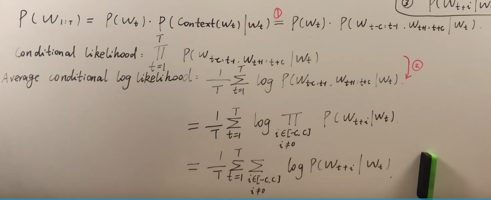
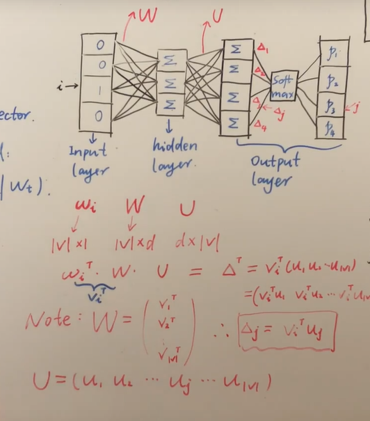

## Word Vector

#### Word representation

- one-hot
  - 解释性强，没有信息丢失
  - 维度过大
  - discrete for each element
  - local: 只有一位决定该单词的词向量
- distributed representation
  - 相对低维
  - real element for each elements
  - distributed

#### word2vec

- 三个假设
  - 窗口
  - 条件联合概率是独立同分布
  - $P(w_{t+i}|w_t)$ 是独立同分布

- word2vec 神经网络没有激活函数

- 神经网络训练得到的**权重**是词向量结果

)

- 目标函数

  - $p_j=softmax(v_i^T u_j)$​

    

