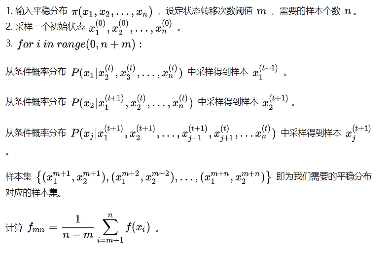

### 0330 阿里一面

- LDA细节

  - 以我的理解可以分为通过两个dirichlet分布和两个多项式分布来生成文章的过程

    - 第一个dirichlet分布$\alpha$取样生成文档主题分布$\theta_i$
    - 从文档主题分布$\theta_i$中生成取样文档i第j个词的主题$z_{i,j}$
    - 从第二个dirichlet分布$\beta$取样生成主题$z_{i,j}$对应的主题词分布$\phi_{z_{ij}}$
    - 从主题词分布$\phi_{z_{ij}}$采样并最终生成词语$w_{i,j}$

  - 多项式分布是二项分布在多维度的推广，二项分布的共轭分布是beta分布，dirichlet分布是beta分布在多维度的推广，dirichlet分布是多项分布的共轭先验分布-

  - LDA中概率联合分布:

    

    - 等价下式：

    

    - Gibbs采样求解,通过周围词的分布和观测的词来求出当前位置主题为k的概率

      

    -  仔细观察上述结果，可以发现，式子的右半部分便是，这个概率的值对应着的路径概率。如此，K 个topic 对应着K条路径，Gibbs Sampling 便在这K 条路径中进行采样，如下图所示

      

- EM算法简介

  - EM算法又叫期望最大算法，其基本思想是随机选取一个值去初始化待估计的值$\theta^{(0)}$,通过不断迭代寻找更优的$\theta^{(n)}$来使得似然函数$L(\theta^{(n)})=p(x|\theta)$更大，假定现在得到了$\theta^{(n)}$，那么：$\theta^{(n+1)}=max_{\theta}L(\theta) -L(\theta^{(n)})$
  - EM算法的关键在于要找到$L(\theta^{(n)})$的一个下界$Q(\theta;\theta^m)$,然后不断最大化这个下界，通过不断求解下界$Q(\theta;\theta^m)$的最大化，来逼近最大化似然函数。
  - EM算法一般步骤
    - 首先随机或者根据先验知识初始化$\theta^{(0)}$
    - 不断迭代以下两步,直到收敛
      - 给出当前的参数$\theta_{n}$估计，计算似然函数的下界$Q(\theta;\theta^m)$
      - 重新估计参数$\theta_{n+1}$,使得$\theta_{n+1} = max_{\theta} Q(\theta;\theta_m)$  
  - 不一定得到最优解

- 蒙特卡洛相关?

  - 蒙特卡洛：

    - 抽象定义：通过概率模型的随机抽样来进行近似数值计算的方法,比如估计$\pi$

    - 简单理解：目标是求解某个**参量**，直接求解出现困难，将其构建为一个合适的概率模型，对这个模型进行大量的采样和统计实验，使它的某些**统计参量**正好待求问题的解，只需要把这个参量的值统计出来，那么问题的解就是估计的值。

    - 蒙特卡洛的解法：

      - 拒绝-接受采样:这种方法适用于$p(x)$极度复杂不规则的情况

      - 利用$q(x)$进行采样，然后设置一定概率来接受和保留它

        

  - 马尔可夫蒙特卡罗法：以马尔科夫链为概率模型的蒙特卡洛法，MCMC是构建一个马尔科夫链使其平稳分布就是要抽样的分布, *马尔可夫蒙特卡洛法可以降低采样的难度，提高采样的效率*

    - 马尔科夫链特征:

      - 不可约:每个状态都能去到
      - 非周期：返回时间公约数是1
      - 正常返：离开此状态有限步会返回
      - 零常返: 离开此状态能返回，但需要无穷多步
      - 非常返：离开此状态有限步不一定能回来
      - 遍历定理: **不可约**，**非周期**，**正常返** $\rightarrow$ 有唯一平稳的分布

    - 求解出这个平稳分布就是目标分布

    - 吉比斯采样的目标是从一个已知的目标分布$p(x)$进行采样，并估计某个函数的期望值。$p(x)$是一个多维的随机分布，$p(x)$的联合分布复杂，难以采样，但是能够很容易采样条件概率分布

      

- 变分推断:

  - 原始目标是根据已有的数据推断需要的分布$p$,当$p$不容易表达，不能直接求解，可以尝试使用变分推断的方法，寻找易求解易表达的分布$q$，当$q$和$p$的差距很小的时候，q就可以作为p的近似分布成为输出结果。
- 理解:
    - 输入数据$x$，模型$p(z,x)$
  - 由于后验概率$p(z|x)$不能直接求解
    - 构建后验概率$p(z|x)$的近似分布$q(z;v)$
  - 不断缩小q和p之间的距离直至收敛
    - KL散度用来衡量p和q两个分布的相似程度
    - 
      - 最小化KL散度，可以最大化ELBO过程

- 重采样技巧：

  - 这个方法在VAE中经常使用，这种方法适用于 ![[公式]](https://www.zhihu.com/equation?tex=p%28x%29) 是常见的连续分布，比如正态分布，t分布，F分布，Beta分布，Gamma分布等。

  - 在VAE中使用重采样技术是为了能让网络能够完成反向传播，具体是这样子：

    现在要从 ![[公式]](https://www.zhihu.com/equation?tex=N%28%5Cmu%2C%5Csigma%5E%7B2%7D%29) 中采样一个 ![[公式]](https://www.zhihu.com/equation?tex=Z) ，相当于从 ![[公式]](https://www.zhihu.com/equation?tex=N%280%2C1%29) 中采样一个 ![[公式]](https://www.zhihu.com/equation?tex=%5Cvarepsilon) ，然后让

    ![[公式]](https://www.zhihu.com/equation?tex=Z%3D%5Cmu%2B%5Cvarepsilon%5Ctimes%5Csigma)

    于是，我们将从 ![[公式]](https://www.zhihu.com/equation?tex=N%28%5Cmu%2C%5Csigma%5E%7B2%7D%29) 采样变成了从 ![[公式]](https://www.zhihu.com/equation?tex=N%280%2C1%29) 中采样，然后通过参数变换得到从 ![[公式]](https://www.zhihu.com/equation?tex=N%28%5Cmu%2C%5Csigma%5E%7B2%7D%29) 中采样的结果。这样一来，**“采样”这个操作就不用参与梯度下降了，改为采样的结果参与，使得整个模型可训练了。**

  - 另一种理解
    - 比如需要对$\cfrac{\partial L}{\partial Z}$，由于$Z$是通过采样得到的，后向传播无法继续向前面传导了，使用重参数技巧之后,![[公式]](https://www.zhihu.com/equation?tex=Z%3D%5Cmu%2B%5Cvarepsilon%5Ctimes%5Csigma) 。 ![[公式]](https://www.zhihu.com/equation?tex=%5Cfrac%7B%5Cpartial+L%7D%7B%5Cpartial+%5Csigma%5E%7B2%7D%7D%3D%5Cfrac%7B%5Cpartial+L%7D%7B%5Cpartial+Z%7D%5Cfrac%7B%5Cpartial+Z%7D%7B%5Cpartial+%5Csigma%5E%7B2%7D%7D%3D%5Cfrac%7B%5Cpartial+L%7D%7B%5Cpartial+Z%7D%5Cvarepsilon)
      这样就可以正常使用反向传播了。

- 贝叶斯定理,讲一下最大似然估计？

  - 极大似然估计和贝叶斯估计都是统计两种对模型参数确定的方式

    - $p(\theta)$:先验概率；  $p(\theta |D)$ 后验概率；$p(D)$ :数据分布；$p(D|\theta)$:似然函数

  - 极大似然估计

    - 属于频率派思想，认为参数是固定的，我们通过大量样本数据来估计这个参数。

    - 理解: 求得一组参数使得这个分布生成这些样本数据的概率最大
      $$
      l(\theta)=\prod_i^{n}p(x_i|\theta)
      $$

    - 极大似然估计

    $$
    argmax_{\theta}\prod_i^{n}p(x_i|\theta)
    $$

    

  - 贝叶斯估计

    - 属于贝叶斯派思想:  认为参数是不固定的，但是符合某种分布，通过认为设定的$p(\theta)$，然后结合MAP来求一个具体的$\theta$ ，**先验分布+样本信息=>后验分布**

    - MAP(最大后验概率,用来拟合贝叶斯估计):
      $$
      argmax_{\theta}p(\theta|D) = argmax_{\theta} \cfrac{p(D|\theta)p(\theta)}{p(X)}
      $$

      - 最大后验估计不考虑$p(X)$的影响

      $$
      argmax_{\theta}p(\theta|D) = argmax_{\theta} \cfrac{p(D|\theta)p(\theta)}{p(X)} \propto  argmax_{\theta} p(D|\theta)p(\theta)
      $$

    - 由于极大似然估计中假设$p(\theta)$是固定的，所以它可以直接推导为极大似然估计

    - 贝叶斯估计考虑了$p(X)$是不可忽略的，通过积分来拟合$p(X)$

    $$
    P(\theta|X)=\frac {P(X|\theta)P(\theta)} {\int_{\Theta}P(X|\theta)P(\theta)d\theta}
    $$

- 能不能说一下random forest 和 Gradient Boosting的区别？

  - random foreset目标是随机抽样多个样本集，训练多个决策树学习器，决策树分裂特征也是随机选取。他的训练目的是降低方差
  - gradient boosting是学习多轮学习器，每一轮使用梯度用于拟合上一轮的残差，它的目标是降低偏差
  - 区别
    - 从算法分类角度来说，random forest属于bagging算法，gradient Boosting属于boosting算法
    - 从训练角度上来说，random  forest可以做到并行训练，gradient boosting 只能做到串行训练
    - 从学习器角度来说，random forest对所有学习器平等看待，而gradient boosting会给每一轮学习器赋权

- 说一下XGBoost的三种信息度量方式？(问题没太听懂)

  - XGBoost不在使用熵和基尼系数作为结构分数
  - $obj= \cfrac{1}{2} \cfrac{G^2}{H+\lambda} + \gamma$, G表示一阶导数，H表示二阶导数
  - $Gain=\cfrac{1}{2}[\cfrac{G_L^2}{H_L+\lambda}+\cfrac{G_R^2}{H_R+\lambda}+\cfrac{(G_L+G_R)^2}{H_L+H_R+\lambda}] - \gamma$
  - 分割之前的损失值和分割之后的损失值做差

- 说一下LSTM和RNN的区别？

  - RNN和LSTM都是循环神经网络
  - RNN是最原始的循环神经网络，LSTM是其改进，设置门控和细胞状态来捕捉长短时依赖
  - LSTM可以缓解RNN的梯度消失和梯度爆炸

  $$
  i_t = \sigma (W_i[X_t,h_{t-1}])\\
  o_t = \sigma (W_o[X_t,h_{t-1}])\\
  f_t = \sigma (W_f[X_t,h_{t-1}])\\
  C'_t = tanh(W_C[X_t,h_{t- 1}])\\
  C_t = f_t * C_{t-1} + i_t * C'_t\\
  h_t = o_t * tanh(C_t)
  $$

  - GRU

  $$
  z_t = \sigma (W_z[X_t,h_{t-1}])\\
  r_t = \sigma (W_r[X_t,h_{t-1}])\\
  h'_t = \sigma (W_h[X_t,r_t*h_{t-1}])\\
  h_t = (1-z_t) h'_t +  z_t h_{t - 1}
  $$

  

- PCA懂吗？说一下PCA图中的长箭头是什么物理含义？

  - 投影方差最大的方向
  - PCA目标是最大化样本协方差矩阵，降维后的方向就是协方差矩阵对应的较大特征值对应的特征向量
  - PCA和LDA的区别与联系
    - PCA是无监督学习，LDA是监督学习
    - 两者目标都是求解最佳投影平面
    - PCA的目标是投影得到方差最大的方向，LDA的目标是类间方差大，类内方差小，且利用了标签信息

- Attention机制？

  - 机器翻译任务为例，Q表示源文本，V表示目标文本,K表示源文本中的每个位置的词
  - 捕捉输入序列中每个位置对输出序列每个位置的权重

- SQL中如何分组排序？

  - https://my.oschina.net/u/3044454/blog/4471608
  - row_number()
  - rank(）
  
  - dense_rank()
  
  - ntile()